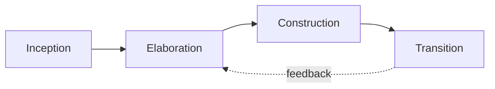

# Decentralized Digital Library — MVP

> **Open-source MVP** of an online library where anyone can submit digitized works; **librarians** moderate submissions and **publish only** **public-domain** items, each with a **country-specific restrictions notice**.
> Uses **AUP (Agile Unified Process)**, **UML**, **Python + Pyramid**, **TAL/METAL** templates, and **Git-based** storage for works.

---

## 🚩 Goals

* Deliver a **functional MVP**: submission, moderation, publication, and access to works.
* Work in **heterogeneous pairs** (complementary skills), with **peer assessment** counting toward the grade.
* Practice **OO architecture**, **AUP**, **UML**, **design patterns**, and **living documentation**.

**Required references**

* AUP: [https://en.wikipedia.org/wiki/Agile\_unified\_process](https://en.wikipedia.org/wiki/Agile_unified_process)
* Course notes (*Software Architecture* excerpts provided):
  [https://github.com/michaellaunay/NotesPubliques/blob/master/cours/Architecture%20des%20logiciels.md](https://github.com/michaellaunay/NotesPubliques/blob/master/cours/Architecture%20des%20logiciels.md)

---

## 🌐 Project Context

Client: **CultureDiffusion** (non-profit) — building a **decentralized digital library**.

### Functional objectives (highlights)

* Let members submit digitized works (PDF, etc.) and request sharing.
* **Multi-AI OCR** (e.g., Gemini, Pixtral) for text & diagrams.
* Free access to **public-domain** works.
* **Licensed digital lending** (2-week term) with encryption.
* **Auto-distribution** when works become public domain.
* **Markdown export** of works.
* **Moderation workflow**: verification, metadata enrichment, approve/reject.
* Manage rights/copies according to applicable law.

### Library repository layout (Git folders)

* `fond_commun/` — public-domain works.
* `emprunts/` — licensed loans (encrypted with member key).
* `sequestre/` — licensed, held in escrow with restricted access.
* `a_moderer/` — submissions pending librarian review.

> ⚖️ **Legal note**: public-domain status can **vary by jurisdiction** (term, exceptions, neighboring rights). Each publication includes a **territorial restrictions notice**.

---

## 🛠️ Tech Choices

* **Language**: **Python** (client requirement).
* **Web framework**: **Pyramid**.
* **Templates**: **TAL/METAL** (Zope/Plone heritage).
* **Client (per pair’s choice)**:

  * **SolidJS** (modern, performant), or
  * **Bootstrap** (simple, fast prototyping).
* **Works persistence**: **Git** (no RDBMS for the work files).
* **Each feature ships a CLI** module, runnable & testable in isolation.
* **AI traceability**: document prompts, model/version, params, outputs.

---

## 📦 Quick Start

### Prerequisites

* Python 3.12+ • Git • (optional) Node 20+ if using SolidJS
* `pipx` recommended, otherwise `venv`

```bash
# 1) Clone
git clone https://github.com/<org>/<repo>.git
cd <repo>

# 2) Python env
python3 -m venv .venv && source .venv/bin/activate
pip install -U pip wheel
pip install -r requirements.txt

# 3) Environment
cp .env.example .env
# Fill AI keys, OCR settings, etc.

# 4) Run dev server
pserve development.ini --reload
# http://localhost:6543

# 5) Run tests
pytest -q
```

---

## 🗂️ Recommended Repository Structure

```
.
├─ README.md
├─ LICENSE
├─ .env.example
├─ requirements.txt
├─ development.ini
├─ src/
│  ├─ app/                     # Pyramid package
│  │  ├─ __init__.py
│  │  ├─ routes.py
│  │  ├─ views/
│  │  ├─ templates/            # TAL/METAL
│  │  ├─ domain/               # OO: entities, services, patterns
│  │  ├─ infra/                # Git, crypto, OCR, storage
│  │  └─ api/                  # REST endpoints
│  └─ cli/
│     ├─ deposit.py
│     ├─ moderate.py
│     ├─ ocr.py
│     └─ export_md.py
├─ docs/
│  ├─ en
│  │  ├─ Conception/
│  │  │  ├─ _Conception.md
│  │  │  ├─ Requirements Analysis.md
│  │  │  ├─ Business Glossary.md
│  │  │  ├─ Technical Glossary.md
│  │  │  ├─ Technical Requirements.md
│  │  │  ├─ Scenarios/
│  │  │  ├─ Class Diagrams/
│  │  │  ├─ State Machines/
│  │  │  └─ Activities/
│  │  ├─ Design Journal.md
│  │  ├─ UI/
│  │  └─ ADR/                     # Architecture Decision Records
│  ├─ fr
│  │  ├─ Conception/
│  │  │  ├─ _Conception.md
│  │  │  ├─ Analyse du cahier des charges.md
│  │  │  ├─ Glossaire métier.md
│  │  │  ├─ Glossaire technique.md
│  │  │  ├─ Exigences techniques.md
│  │  │  ├─ Scenarios/
│  │  │  ├─ Diagrammes de classes/
│  │  │  ├─ Diagrammes d'états transitions/
│  │  │  └─ Activités/
│  │  ├─ Journal de conception.md
│  │  ├─ Interface graphique/
│  │  └─ ADR/                     # Architecture Decision Records
├─ tests/
│  ├─ unit/
│  └─ integration/
└─ data/
   ├─ fond_commun/
   ├─ emprunts/
   ├─ sequestre/
   └─ a_moderer/
```

---

## 🧭 Process & Pedagogy

* **Heterogeneous pairs**: each pair owns a **module** (OCR, moderation, deposit, distribution, export, etc.).
* **Peer review/assessment**: pairs **audit** one another (code, design, docs, tests).
* **AUP (iterative & incremental)**:

  * **Inception** → vision, actors, top use cases, risks.
  * **Elaboration** → candidate OO architecture + UML, prototypes.
  * **Construction** → short iterations, increments, automated tests.
  * **Transition** → release, docs, user feedback.



---

## 📘 UML & Documentation

* **Diagrams**: PlantUML / Mermaid / D2.
* **Architectural views** (per course annexes):

  * **Logical** (domain model, services)
  * **Process** (threads, queues, OCR jobs)
  * **Development** (modules, deps)
  * **Physical** (deployment, nodes)
* **Glossaries** (business & technical), **ADR**, **Design Journal** (Markdown).
* **Naming**: consistent between glossary ↔ UML ↔ code.
  Python: **PEP 8** (`snake_case`, classes in `PascalCase`), single-language terminology (English recommended within code).

> Example PlantUML — classes (save as `docs/Conception/Class Diagrams/global.puml`)

```plantuml
@startuml
class Work {
  +id: UUID
  +title: str
  +authors: list
  +legalStatus: RightsStatus
  +countryRestrictions: list
  +files: list
  +metadata(): dict
}
class Submission { +memberId: UUID +timestamp: datetime }
class ModerationDecision { +status: enum +comment: str +restrictionsNotice(): str }
class Loan { +memberId: UUID +start: date +end: date +encryptionKey: bytes }
Work "1" <-- "0..*" Submission
Work "1" <-- "0..*" ModerationDecision
Work "0..*" <-- "0..*" Loan
@enduml
```

---

## 🔐 Legal & Compliance

* **Per-work notice**: source, legal status, countries, authors’ death dates, term, neighboring rights, exceptions.
* **Territoriality**: availability may **differ by country**.
* **Traceability**: keep moderation decisions history.
* **Privacy (GDPR)**: data minimization, encrypted loans, lean logs.
* **Licensing**:

  * **Code**: recommend **AGPL-3.0**.
  * **Content**: public domain / compatible licenses; include a **clear notice** per work.

---

## 🧩 Quality, Tests, CI/CD

* **Linters**: `ruff`, `black`, `isort`, `mypy` (if using typing).
* **Tests**: `pytest` (unit & integration), mocks for AI/OCR.
* **Coverage**: `pytest --cov`
* **CI**: lint + tests + (optional) front build + UML rendering for docs.
* **CLI-first**: every feature exposes a **standalone CLI** with tests.

---

## 🤖 AI & OCR Usage Policy

* Record **model**, **version**, **prompt**, **parameters**, **output hash**, **costs**.
* **Measure** OCR accuracy (samples & ground truth), ensure **reproducibility**.
* Provide **fallback** (Tesseract) if cloud AI is unavailable.
* Store prompts under `docs/IA/prompts/` with a **comparison report**.

---

## 🔧 CLI Examples

```bash
# Submit a work
python -m src.cli.deposit --input ./scans/my_book.pdf --meta ./meta/my_book.yaml

# Run OCR
python -m src.cli.ocr --input ./a_moderer/xxx.pdf --engine pixtral --lang fr

# Moderate (approve/reject + notice)
python -m src.cli.moderate --id <UUID> --decision approve --notes "Public domain FR/BE, restricted US"

# Export Markdown
python -m src.cli.export_md --id <UUID> --out ./exports/<UUID>.md
```

---

## 🧱 Contributing

1. **Fork & branch**: `feat/<short-name>` — **small, signed commits**.
2. **Naming**: respect glossary, PEP 8, UML ↔ code consistency.
3. **Docs**: update `docs/` (add an **ADR** for non-trivial decisions).
4. **Tests**: include unit & integration tests.
5. **Review**: an **external pair** performs the **peer review**.
6. **PR checklist**

   * [ ] Lint/Tests pass
   * [ ] Docs/ADR updated
   * [ ] Security/Legal check (notice, restrictions)
   * [ ] CLI usable in isolation

---

## 🗺️ MVP Roadmap (suggested)

* [ ] Submission (file + YAML metadata)
* [ ] OCR (local + AI pipeline, logged)
* [ ] Moderation (workflow + decisions + notices)
* [ ] Publish to `fond_commun/`
* [ ] Encrypted lending to `emprunts/`
* [ ] Markdown export
* [ ] Minimal front (Bootstrap **or** SolidJS)
* [ ] CI, tests, coverage, auto-render UML

---

## 📜 License

* **Code**: AGPL-3.0 (recommended) — see `LICENSE`.
* **Works**: status varies (public domain / under rights). Each work carries a **legal notice** and **territorial restrictions**.

---

## 👥 Authors & Credits

* Teaching staff & students (heterogeneous pairs).
* *Software Architecture* course — annexes included in `docs/`.
* AUP — Scott Ambler.

*Please follow the contribution guide, naming policy, and legal traceability.*

---

### Annexes (see `docs/`)

* **Architect roles**, **OO & patterns**, **quality attributes**, **architectural views**, **documentation**
* **Markdown & UML guide** (PlantUML, Mermaid, D2)
* **Repository documentation structure** (journal, glossaries, scenarios, diagrams, UI)
* **Architecture evolution & technical debt**
