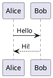
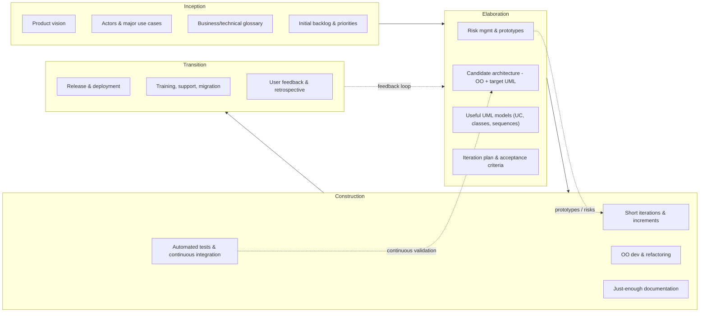

# Project: Design and Architecture of a Decentralized Digital Library

The project consists of developing an **MVP (Minimum Viable Product)** for an online digital library.

During the course, we will form **heterogeneous pairs** (bringing together students with different skills and backgrounds) and work through the various stages of **design** and **development**.
The goal is for each pair to autonomously and responsibly take charge of part of the project.

In turn, pairs will also be tasked with **evaluating each other’s work**. This exercise in **cross-evaluation** will not only build a critical and constructive perspective, but will also yield lessons to improve their own practices and the quality of their deliverables.
**Peer evaluation** will be fully incorporated into the **final grade**.

To that end, we will follow the principles of **[Agile Unified Process (AUP)](https://en.wikipedia.org/wiki/Agile_unified_process)**, proposed by Scott Ambler.
This approach is a **fusion of agile methods and the Y-cycle**, combining the rigor of object-oriented modeling with the flexibility of short, incremental iterations.
It also encourages collaborative practices such as **Pair Programming**, promoting code quality, knowledge sharing, and error reduction.

You must rely on the excerpts from my **Software Architecture** course provided in the annexes.

---

## General Overview

The project is to develop a library of digitized works. Each user of the library can submit digital files and request that they be shared. For example, works may be books scanned to PDF; **this raises issues of intellectual property**, which will be **resolved** by moderation carried out by librarians.

For compatibility with existing systems, the **client mandates Python** as the implementation language.

The chosen **server-side web framework** is **Pyramid**, and the template language is **TAL/METAL** (inherited from Zope/Plone, ensuring backward compatibility).

On the client side, developers may choose either:

* **SolidJS**, a modern React-like framework based on JSX—fast and flexible; or
* **Bootstrap**, a more traditional (“old school”) solution that is easy to implement and fast to prototype.

The **managed documents** must be handled through a **Git repository**, not a traditional **database**, because in the long term an application must be developed so that devices (computer or mobile phone) can access texts as a **file tree**. For those not comfortable with Git, there is a series of free trainings: [https://www.youtube.com/watch?v=0sGQgfUdCAY](https://www.youtube.com/watch?v=0sGQgfUdCAY)

Each **feature must be developed modularly**, independent from the rest of the system, and must be **usable and testable from the command line** to facilitate continuous integration and unit validation.

Given the time constraints, the use of **artificial intelligence** is **strongly recommended**, but it must be **fully documented and traceable**. Prompts will be discussed in class. To prepare, students must watch and understand the video **“The 4 Steps to Train a LLM”** ([https://www.youtube.com/watch?v=YcIbZGTRMjI](https://www.youtube.com/watch?v=YcIbZGTRMjI)) before class.

This project is a teaching vehicle for **object-oriented software architecture**, **UML modeling**, **design patterns**, and **documentation**.

During the course, students will work in **heterogeneous pairs** (different skill sets/backgrounds). Each pair will be responsible for part of the design and development, and will then present and justify their choices.

It is imperative to comply with the **excerpts from the Software Architecture course** provided in the annexes (architect roles, OO design, quality attributes, architectural views, documentation, importance of naming, etc.).

---

## Project Context

The **CultureDiffusion** association wishes to build a **decentralized digital library**.

### Functional Objectives

* Allow each member to digitize works to PDF and offer them for lending.
* Provide OCR of digitized works using multiple AIs (Gemini, Pixtral).
* Offer free access to public-domain works.
* Enable two-week **digital lending** of works under rights.
* Automatically distribute works that enter the public domain to all members with shared disk space.
* Allow downloading of works in **Markdown** format.
* Manage the process enabling librarians to **moderate** works submitted by members (verification, metadata enrichment, approval or rejection).
* Manage rights and copies according to applicable law.

### Library Repository Structure (folder metaphor)

* `fond_commun`: public-domain works provided by the association.
* `emprunts`: works under rights that have been loaned, encrypted with the member’s key.
* `séquestre`: works under rights pending, managed by the association, with restricted access.
* `a_moderer`: works proposed by members, pending librarian validation.

### Classification of Works

* **Books**: Comics, Novels, Children, Technical, Education, Culture, Health, etc.
* **Music**: Classical, Jazz, Pop, Metal, etc.
* **Videos**: Sci-Fi, History, Series, Documentaries, etc.
* **Articles**.
  A work may belong to multiple categories simultaneously.

---

## Required Work

### Part 1: Analysis and Glossary

1. Identify **concepts** (entities, roles, actions, properties) in the specification.
2. Develop a **business glossary** and a **technical glossary** (clear definitions, alphabetized).
3. Justify your vocabulary choices with respect to the importance of **names and naming conventions (5.5)**.

### Part 2: UML Modeling

* Produce the **global use-case diagram**.
* List the **fundamental scenarios** of the application; add more if needed.

  * Example: application installation, becoming a member, borrowing a work, proposing a work, recognizing the text and diagrams of a work, moderating a work, browsing the common pool, exporting a work to Markdown.
* Sort scenarios by importance.
* Produce **at least 4 system sequence diagrams** for the main scenarios, including **2 not proposed by any other pair**.
* Create **5 class diagrams** associated with the most critical scenarios.
* Produce a **global class diagram** detailing associations and cardinalities.
* Provide **activity diagrams** to explain document processes (workflows).

### Part 3: Architectural Choices

1. Describe the chosen **software architecture** (e.g., layered, service-oriented, simplified microservices).
2. Justify your choices with regard to **quality attributes** (performance, security, maintainability, modularity, scalability).
3. Identify the **design patterns** used (e.g., Singleton, Factory, Observer, Strategy) and justify their relevance to this project.
4. Explain how **documentation** (chapter 3 of the annexes) will be integrated into the project workflow (Markdown, Git, embedded UML diagrams).

### Part 4: Naming and Quality

1. Define a **naming guide** suited to the project (inspired by §5.5: consistency, conventions, readability).
2. Verify consistency between:

   * the business glossary,
   * UML classes and modules,
   * scenarios,
   * documentation.
1. Propose **automated tools** (linters, formatting rules, CI/CD for docs) to improve quality.

---

## Constraints

* Use **PlantUML** or **Mermaid** or **D2** for diagrams (AI can convert diagrams, but you must verify the produced semantics).
* Follow **object-oriented design** principles (encapsulation, inheritance, polymorphism).
* Explicitly include **architectural views** (logical, process, development, physical).
* Document your choices in a **structured Git repository** (see chapter 5 of the annexes).

---

## Expected Deliverables

1. Business and technical glossaries (Markdown).
2. Use-case diagram + detailed scenarios (Markdown + PlantUML).
3. Sequence diagrams (PlantUML).
4. Class diagrams (scenario-specific and global).
5. Document justifying architectural choices and design patterns.
6. Naming guide (Markdown).
7. Documented Git repository with a tree matching course recommendations.
8. Initial implementation of the main features as **independent scripts** that can be integrated into a whole or used on their own (use `.env` for keys to query AIs).
9. Unit tests.
10. Integration tests.
11. Validation tests.

---

# Annexes

## 1.3 Roles and Responsibilities of the Software Architect

A software architect plays a crucial role in software development. Responsibilities range from technical design to coordinating development teams. Key responsibilities include:

* **System Architecture Design**: Understand functional and non-functional requirements; design a structure that satisfies them while considering constraints and trade-offs.
* **Architectural Decision-Making**: Choose technologies, define interfaces, decompose into components, and define how components interact.
* **Architecture Documentation**: Provide an overview of the system; describe components, interactions, decisions made, and rationale.
* **Team Communication**: Explain the architecture, facilitate understanding, resolve architectural issues, and coordinate development efforts.
* **Architectural Quality Control**: Ensure the architecture is implemented correctly and maintained; assess quality, identify/resolve architectural problems, and ensure changes remain aligned.
* **Technology Planning & Management**: Stay up to date; plan integration of new technologies and manage architectural evolution over time.

## 1.5 Relationship Between Software Architecture and Object-Oriented Design

Object-oriented design (OOD) uses “objects”—instances of classes often representing real-world things. OOD integrates concepts such as encapsulation, inheritance, and polymorphism to structure code naturally.

* **Implementing Architecture with OOD**: Architecture defines the high-level structure; OOD provides mechanisms to realize it. Architectural components may map to classes or groups of classes; interfaces map to interfaces or abstract classes; architectural patterns can be implemented via OO design patterns.
* **Influence of OO Concepts on Architecture**: Encapsulation promotes decoupling and modularity; inheritance promotes reuse; polymorphism enables extensibility and flexibility.

See \[\[Design patterns]].

## 1.6 Quality Attributes in Software Architecture

Quality attributes are non-functional characteristics that influence architectural decisions and overall system quality:

* **Performance**: responsiveness, throughput, resource use.
* **Security**: resilience against attacks; data/service protection; minimal vulnerabilities; quick recovery from incidents.
* **Maintainability**: ease of modification; clear design; coherent coding conventions; good documentation and adequate tests.
* **Modularity**: degree to which the system can be divided into independent modules; supports maintainability, scalability, and reuse; enables isolated development and testing.
* **Scalability**: ability to handle increased workload; via more resources and/or functional growth.

**Conclusion on Quality**: Architects must understand and balance these attributes to meet quality goals.

## 1.8 Architectural Views

To communicate and understand architecture, we use different **views**:

* **Logical View**: functionality from the user’s perspective; main classes/components, responsibilities, relationships, interactions.
* **Process View**: runtime processes/threads and their communication; system behavior in response to events; useful for performance/concurrency.
* **Development View**: code organization, package/module dependencies, build/deploy approach; useful for developers and PMs.
* **Physical View**: deployment across hardware; mapping components to nodes; node communication; useful for sysadmins and architects.

**Synthesis**: Views must be **consistent** with each other.

## 1.9 Importance of Documentation in Software Architecture

Documentation is a key communication tool and helps maintain architectural coherence over time (especially with changes or team turnover).

* **Architectural Decisions**: record rationale, alternatives considered, and reasons for rejection; helps future decision-making and onboarding.
* **Architectural Views**: document how the system is designed, how it works, and how it’s deployed; identify dependencies and interactions.
* **Quality Attributes**: document how quality attributes influenced architecture; check that the architecture meets quality requirements and identify improvements.

**Bottom line**: Documentation is a necessity, not a luxury.

---

# 3. Documenting Software Architecture

* **Why document**: understand internals, maintain/evolve, track thought processes and decisions (including discarded ideas).

* **Why Markdown**:

  * Collaboration with text files (Obsidian, Markdown Memo).
  * Coherence with code; boosts alignment between code and architecture.
  * Readable and accessible without specialized software.
  * Integrates with many tools (diagrams, tasks, time tracking, mind maps/notes).
  * Versionable with Git: track changes, revert, resolve conflicts, collaborate.

* **Integration in workflow**: keep documentation in a Git repo alongside the code; include README, design journal, time management, technical notes, and design directories.

* **Representing views**: use UML diagrams and UI sketches; integrate Mermaid/PlantUML in Markdown.

---

# 4. Tools to Document Architecture

* Tools such as **Obsidian** and **VS Code** (Markdown Memo) help with Markdown notes/journals; they **do not replace UML modelers** for semantic checks but can render diagrams.

## 4.1 Embedding Diagrams in Obsidian or Markdown Memo

### 4.1.1 Using PlantUML

1. Install the PlantUML extension for VS Code.
2. Create the diagram in a `plantuml` code block (remove the escape in front of the backticks in practice):

````markdown
\```plantuml
@startuml
Alice -> Bob: Hello
Bob --> Alice: Hi!
@enduml
\```
````

Rendered example:



### 4.1.2 Using Mermaid

````markdown
\```mermaid
graph TD;
    A-->B;
    A-->C;
    B-->D;
    C-->D;
\```
````

Rendered example:


### 4.1.3 Using Terrastruct/D2

Terrastruct/D2 provides open standards and viewers. D2 (still alpha) is ambitious and extensible; usage is similar to Mermaid.

---

# 5. Suggested Git Repository Structure for Architecture Documentation

Include architecture documentation **alongside the code** in the Git repo, with accessible, versioned documents and clear references between code and a given documentation version.

At the root:

* `README.md` (project overview)
* `Design Journal.md`
* `Time Management/` (daily notes, project logs)
* `Notes/` (technical notes)
* `Tracking.md` (tasks with Obsidian Task/Kanban)
* `Conception/` (analysis and design documents)

### 5.1 Root `README.md`

Should include: project title, goal, detailed description, last modification date, authors list, current version, and links to sub-directory indexes.

### 5.2 `Design Journal.md`

Daily journal: reflections, observations, questions, significant notes; trace the evolution of ideas and **architecture decisions** across the project; reference detailed notes in `Notes/`.

### 5.3 `Time Management/`

Maintain lists of completed tasks (e.g., **Getting Things Done**), daily notes, backlog tickets, canvas, Gantt/PERT, task allocation boards—choose what fits your project and produce the corresponding docs (Markdown).

### 5.4 `Conception/` Directory

Contains:

1. **`_Conception.md`** — index of the directory
2. **`Requirements Analysis.md`** — tag concepts/proper names/actions/properties with CSS classes
3. **`Business Glossary.md`**
4. **`Technical Glossary.md`**
5. **`Technical Requirements.md`** — constraints (performance, accessibility, languages, security, privacy, GDPR, coherence) with acceptance gauges/scenarios
6. **`Scenarios/`** — `_Scenarios.md` index + one Markdown per scenario; one sequence diagram per scenario with the system as a black box; then one or more detailed sequence diagrams where the system is a white box with classes created to realize the functions; iterate with associated class diagrams (QQOQCP and CRUD) until reasonably stable
7. **`Class Diagrams/`** — `_Class Diagrams.md` index; a **global** class diagram (all classes & associations, Mermaid/PlantUML); per-scenario class diagrams showing only the attributes/methods needed for that scenario
8. **`State Machines/`** — `_State Machines.md` index; one state-machine diagram per identified data type
9. **`Activities/`** — `_Activities.md` index; one activity diagram per identified process
10. **`UI/`** — `_UI.md`; describe windows/screens using PlantUML Salt

### 5.5 The Importance of Naming in OO Architecture

* **Readability & Understanding**: names reflect role/responsibility/domain; single language across the codebase.

* **Consistency & Conventions**:

  * Classes: PascalCase (e.g., `LoanManager`)
  * Methods/attributes: camelCase (e.g., `publicationDate`, `authenticate()`)
  * Constants: UPPER\_SNAKE\_CASE (e.g., `MAX_LOANS`)
  * Keep code, docs, and **UML** aligned (note: Python **PEP 8** recommends `snake_case`; Java favors CamelCase).
  * Maintain a shared naming guide and configure linters.

* **Classes/Modules**: use explicit, domain-driven names (`Book`, `Catalog`, `DigitalLibrary` vs. generic `Manager`/`Processor`).

* **Attributes/Methods**: simple, clear, domain language; methods are verbs (`borrow()`, `return()`, `authenticate()`).

* **Relations/Associations**: explicit names clarify nature, cardinality, and dependency.

* **Common Mistakes**: obscure abbreviations, overly generic names, mixed languages, redundant names.

* **Link to Quality**: naming impacts maintainability, evolvability, and collaboration (ubiquitous language).

**Conclusion**: treat naming as an **architectural decision** in its own right.

## 7. Evolution of Software Architecture

* **Changing Business Requirements**: architecture must adapt (new features, new regulations/regions).
* **Technological Advances**: be flexible to incorporate new technologies.
* **Technical Debt**: manage through refactoring and continuous improvement.
* **Future Outlook**: anticipate trends, user/business needs, and plan how the architecture can adapt.

---

# Agile Unified Process (AUP)

## 1. Origin

* Created by **Scott Ambler (2005)** as a **lightweight adaptation** of **RUP**.
* Keeps RUP’s phases (inception, elaboration, construction, transition) but applies **Agile Manifesto (2001)** values:

  * Individuals & interactions over heavy processes
  * Working software over exhaustive documentation
  * Customer collaboration over contract negotiation
  * Responding to change over following a plan

## 2. Core Principles

* **Iterative & Incremental**: short iterations (2–6 weeks), each delivers a working version; phases are traversed at small scale.
* **Minimal Documentation**: only what’s useful; pragmatic UML.
* **Automation & Quality**: unit tests, CI, refactoring; focus on code quality and maintainability.
* **Adaptability**: evolving requirements; progressive planning revised each iteration.

## 3. Disciplines

* **Modeling**: domain understanding; OO design; pragmatic UML; business & technical glossaries.
* **Implementation**: OO development; pair programming possible; follow naming guide.
* **Testing**: automated unit & functional tests; in every iteration; continuous validation of architectural quality.
* **Deployment**: frequent deliveries; CI/CD tooling.

**Support**: configuration management (Git), project management (lightweight, value-driven—Kanban/Scrum), environment (dev/test/CI/CD tooling).

## 4. Phases

1. **Inception**: understand need; identify actors and main use cases; shared vision; priorities (e.g., lending, deposit, moderation).
2. **Elaboration**: baseline architecture; define critical scenarios; simplified UML (main classes, architectural diagram).
3. **Construction**: iterative & incremental development; each iteration delivers usable software; automated tests.
4. **Transition**: final delivery; training, minimum documentation, user feedback; product stabilization.

Phases overlap and recur at small scale in each iteration.

## 5. Advantages

* **Agile yet structured**; fast feedback; pragmatic; quality from the start; well-suited to teaching.

## 6. Limits

* Less widespread than Scrum/SAFe; can feel “awkward hybrid” if misapplied; relies on team discipline.

## 7. Synthesis Diagram

```
         Vision            Architecture          Construction         Delivery
      +-----------+     +----------------+     +---------------+     +-----------+
      | Inception | --> | Elaboration    | --> | Construction  | --> | Transition|
      +-----------+     +----------------+     +---------------+     +-----------+
          |                   |                     |                    |
          v                   v                     v                    v
      Use cases          OO UML design         Iterative dev         Delivery
      Business glossary  Architecture proto    Automated tests       Support
```


