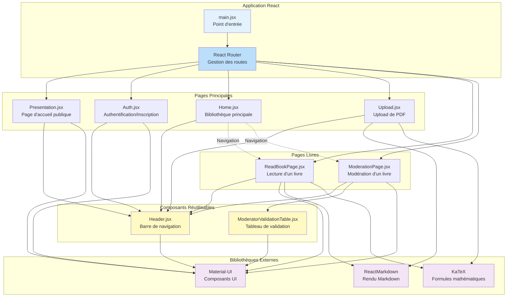
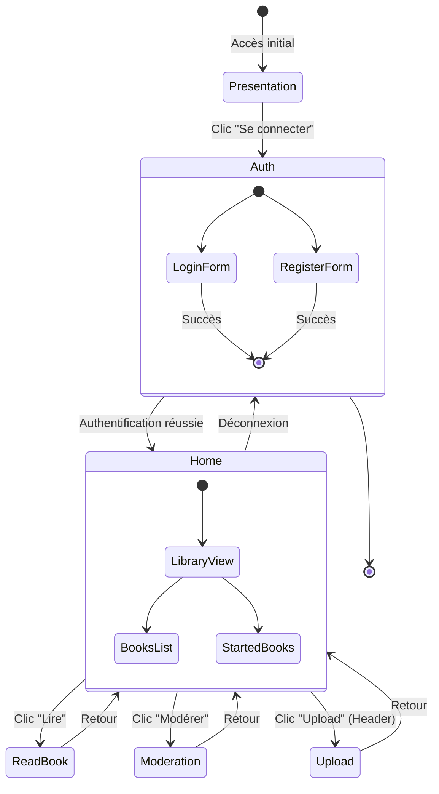
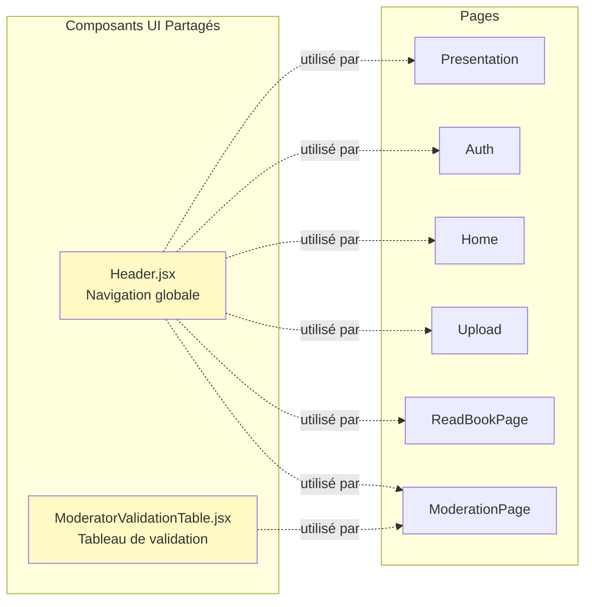

# Architecture Frontend - La Réponse d'V2

## Vue d'ensemble de l'architecture

Ce document présente l'architecture frontend du projet "La Response D", une application React de bibliothèque numérique avec gestion de livres, authentification et système de modération.

## Diagramme de l'architecture



### Fichier PlantUML

Pour une vue détaillée avec PlantUML : [architecture_frontend.puml](architecture_frontend.puml)

## Structure de routage

| Route | Composant | Description |
|-------|-----------|-------------|
| `/` | Presentation | Page publique de présentation du projet |
| `/auth` | Auth | Connexion et inscription des utilisateurs |
| `/home` | Home | Bibliothèque principale - Accueil utilisateur |
| `/upload` | Upload | Interface d'upload de PDF |
| `/book/:bookId` | ReadBookPage | Page de lecture d'un livre avec rendu Markdown |
| `/moderator?book=:id` | ModerationPage | Interface de modération d'un livre |

## Composants principaux

### 1. Point d'entrée - `main.jsx`

Point d'entrée de l'application React qui configure le routeur et définit toutes les routes de navigation.

**Responsabilités :**
- Configuration du React Router
- Définition des routes
- Rendu de l'application

### 2. Pages

#### `Presentation.jsx`
Page d'accueil publique présentant le projet.

**Caractéristiques :**
- Accessible sans authentification
- Présentation du projet et de ses fonctionnalités
- Lien vers la documentation
- Utilise Material-UI pour le design

#### `Auth.jsx`
Page d'authentification et d'inscription.

**Fonctionnalités :**
- Formulaire de connexion
- Formulaire d'inscription
- Appels API vers `/api/login` et `/api/register`
- Gestion des erreurs d'authentification
- Redirection vers Home après connexion réussie

**API utilisées :**
```javascript
POST /api/login
POST /api/register
```

#### `Home.jsx`
Bibliothèque principale affichant tous les livres disponibles.

**Fonctionnalités :**
- Section "Livres commencés" (affichage horizontal)
- Section "Tous les livres" (grille)
- Navigation vers la lecture d'un livre
- Navigation vers la modération d'un livre
- Utilise le composant Header

**Structure :**
- Livres commencés : Carrousel horizontal avec miniatures
- Bibliothèque complète : Grille responsive de cartes de livres

#### `Upload.jsx`
Interface d'upload de documents PDF.

**Fonctionnalités :**
- Upload de fichiers PDF
- Prévisualisation du contenu
- Support Markdown avec rendu LaTeX
- Validation du fichier

#### `ReadBookPage.jsx`
Page de lecture d'un livre avec rendu avancé.

**Fonctionnalités :**
- Récupération du contenu via API
- Rendu Markdown avec ReactMarkdown
- Support des formules mathématiques LaTeX (KaTeX)
- Navigation dans le livre
- Gestion des images

**Technologies :**
- ReactMarkdown pour le rendu Markdown
- remark-math / rehype-katex pour les formules
- Material-UI pour le design

#### `ModerationPage.jsx`
Interface complète de modération d'un livre soumis.

**Fonctionnalités :**
- Affichage des métadonnées du livre
- Tableau de validation des modérateurs (ModeratorValidationTable)
- Onglets pour différentes sections
- Commentaires et notes de modération
- Actions de validation/rejet

**Structure :**
- Onglet "Informations" : Métadonnées du livre
- Onglet "Contenu" : Aperçu du contenu
- Onglet "Validation" : Tableau des modérateurs
- Onglet "Commentaires" : Notes de modération

### 3. Composants réutilisables

#### `Header.jsx`
Barre de navigation fixe en haut de toutes les pages.

**Fonctionnalités :**
- Navigation vers Home
- Bouton Upload
- Responsive
- Utilisé par toutes les pages

**Design :**
- Position fixe en haut
- Couleur bleue (#2196f3)
- Z-index élevé pour rester au-dessus

#### `ModeratorValidationTable.jsx`
Tableau affichant le statut de validation des 3 modérateurs.

**Fonctionnalités :**
- Affichage des 3 modérateurs requis
- États possibles : En attente, Approuvé, Rejeté
- Coloration selon le statut
- Utilisé dans ModerationPage

**Structure du tableau :**
| Modérateur | Statut | Date |
|------------|--------|------|
| Modérateur 1 | En attente / Approuvé / Rejeté | Date de validation |
| Modérateur 2 | En attente / Approuvé / Rejeté | Date de validation |
| Modérateur 3 | En attente / Approuvé / Rejeté | Date de validation |

## Diagramme de flux utilisateur



### Fichier PlantUML

Pour une vue détaillée avec PlantUML : [flux_utilisateur.puml](flux_utilisateur.puml)

## Diagramme de composants réutilisables



### Fichier PlantUML

Pour une vue détaillée avec PlantUML : [composants_reutilisables.puml](composants_reutilisables.puml)

## Bibliothèques externes utilisées

### React Router DOM
**Version :** Latest  
**Utilisation :** Gestion du routage et de la navigation

**Composants utilisés :**
- `BrowserRouter` : Wrapper principal
- `Routes` : Conteneur des routes
- `Route` : Définition d'une route
- `Link` : Navigation entre pages
- `useNavigate` : Navigation programmatique
- `useParams` : Récupération des paramètres d'URL

### Material-UI (MUI)
**Version :** Latest  
**Utilisation :** Bibliothèque de composants UI

**Composants utilisés :**
- `AppBar` : Barre d'application
- `Toolbar` : Barre d'outils
- `Typography` : Texte stylisé
- `Paper` : Conteneur avec ombre
- `Container` : Conteneur responsive
- `Box` : Conteneur de mise en page
- `Table`, `TableHead`, `TableBody`, `TableRow`, `TableCell` : Tableaux
- `Tabs`, `Tab` : Onglets
- `Button` : Boutons
- `TextField` : Champs de saisie
- `Alert` : Messages d'alerte
- `CircularProgress` : Indicateur de chargement

### ReactMarkdown
**Version :** Latest  
**Utilisation :** Rendu des fichiers Markdown en HTML

**Plugins utilisés :**
- `remark-math` : Support de la syntaxe mathématique
- `rehype-katex` : Rendu des formules LaTeX

### KaTeX
**Version :** Latest  
**Utilisation :** Rendu des équations mathématiques

**Caractéristiques :**
- Rendu rapide des formules LaTeX
- Support des notations mathématiques complexes
- CSS importé : `katex/dist/katex.min.css`

## Flux de données et API

### Authentification
```javascript
// Inscription
POST /api/register
Body: { username, password, email }
Response: { message, user }

// Connexion
POST /api/login
Body: { username, password }
Response: { message, token, user }
```

### Gestion des livres
```javascript
// Récupération des livres (à implémenter)
GET /api/books
Response: [ { id, title, author, ... } ]

// Récupération d'un livre
GET /api/books/:id
Response: { id, title, author, content, ... }

// Upload d'un livre
POST /api/upload
Body: FormData avec PDF
Response: { message, bookId }
```

### Modération
```javascript
// Récupération des données de modération
GET /api/moderation/:bookId
Response: { book, moderators, status, ... }

// Validation par un modérateur
POST /api/moderation/:bookId/validate
Body: { moderatorId, status, comment }
Response: { message, updatedStatus }
```

## Style et responsive

### Système de styles
- **Méthode :** Styles inline avec objets JavaScript
- **Avantages :** Colocation du code, pas de conflits de noms

### Couleurs principales
| Couleur | Utilisation | Hex |
|---------|-------------|-----|
| Bleu principal | Header, boutons | #2196f3 |
| Bleu foncé | Titres | #1976d2 |
| Gris clair | Fond | #f5f5f5 |
| Blanc | Cartes, conteneurs | #ffffff |
| Jaune | En attente | #fff3cd |
| Vert | Approuvé | #d4edda |
| Rouge | Rejeté | #f8d7da |

### Responsive
- Utilisation de `100vw` et `100vh` pour occupation plein écran
- `boxSizing: border-box` pour gestion des paddings
- Grilles responsive avec CSS Grid et Flexbox
- Carrousels horizontaux avec `overflowX: auto`

## État et gestion des données

### Données locales (useState)
- État d'authentification
- Liste des livres
- Données de modération
- État des formulaires

### Stockage backend
- Utilisateurs : `users.json`
- Livres : Base de données ou système de fichiers
- Métadonnées : À définir

### Données mockées (à remplacer)
- Liste des livres dans Home
- Données de modération dans ModerationPage
- Tableau de validation des modérateurs

## Points d'amélioration futurs

1. **Gestion d'état globale**
   - Implémenter Context API ou Redux
   - Éviter le prop drilling

2. **Authentification persistante**
   - Stockage du token JWT
   - Refresh token
   - Protection des routes

3. **API réelles**
   - Remplacer les données mockées
   - Implémenter tous les endpoints

4. **Optimisations**
   - Lazy loading des pages
   - Code splitting
   - Optimisation des images

5. **Tests**
   - Tests unitaires (Jest)
   - Tests d'intégration (React Testing Library)
   - Tests E2E (Cypress)

6. **Accessibilité**
   - ARIA labels
   - Navigation au clavier
   - Lecteurs d'écran


