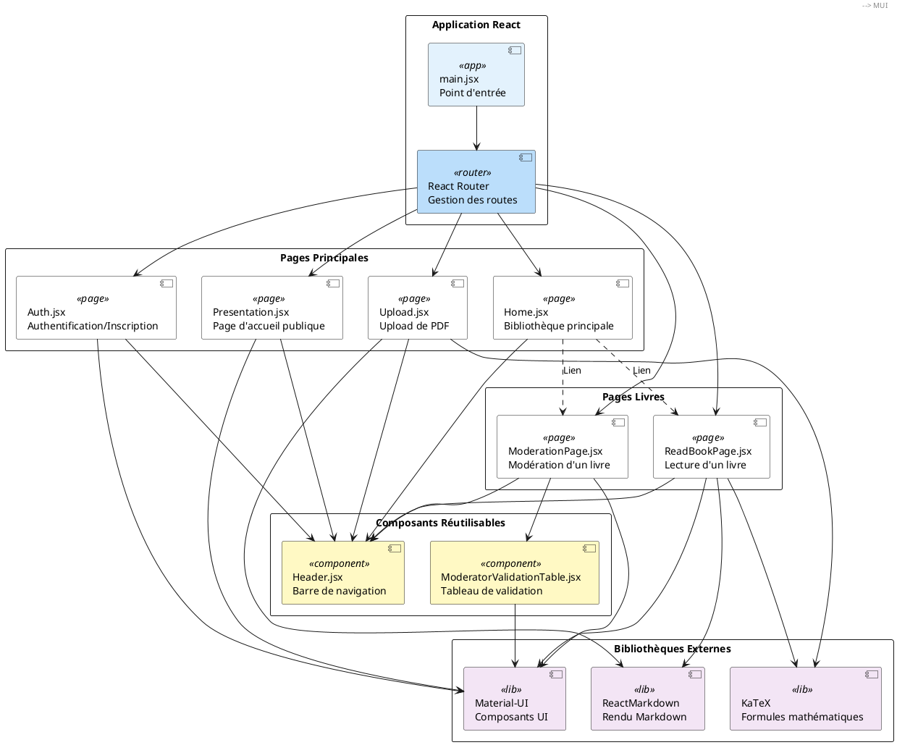
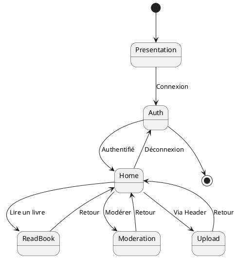
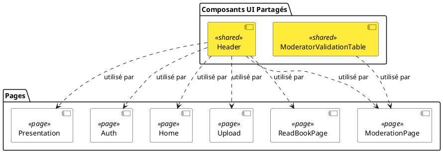

# Architecture Frontend - La Réponse d'V2

## Diagramme de l'architecture



## Description de l'architecture

### Structure de routage

```
/ → Presentation (Page publique de présentation)
/auth → Auth (Connexion/Inscription)
/home → Home (Bibliothèque - Accueil utilisateur)
/upload → Upload (Upload de PDF)
/book/:bookId → ReadBookPage (Lecture d'un livre)
/moderator?book=:id → ModerationPage (Modération d'un livre)
```

### Composants principaux

#### 1. **main.jsx**
- Point d'entrée de l'application
- Configuration du routeur React Router
- Définition de toutes les routes

#### 2. **Pages**

**Presentation.jsx**
- Page d'accueil publique
- Présentation du projet
- Accès à la documentation
- Accessible sans authentification

**Auth.jsx**
- Page d'authentification
- Formulaires de connexion et d'inscription
- Appels API vers `/api/login` et `/api/register`

**Home.jsx**
- Bibliothèque principale
- Affichage des livres commencés
- Affichage de tous les livres disponibles
- Navigation vers ReadBookPage et ModerationPage

**Upload.jsx**
- Interface d'upload de PDF
- Prévisualisation du contenu

**ReadBookPage.jsx**
- Page de lecture d'un livre
- Rendu Markdown avec support LaTeX
- Récupération du contenu via API

**ModerationPage.jsx**
- Interface de modération d'un livre
- Affichage des métadonnées
- Tableau de validation des modérateurs
- Onglets pour différentes sections

#### 3. **Composants réutilisables**

**Header.jsx**
- Barre de navigation fixe en haut
- Liens vers Home, Upload
- Utilisé par toutes les pages

**ModeratorValidationTable.jsx**
- Tableau de statut de validation
- Affiche les 3 modérateurs
- États: En attente, Approuvé, Rejeté

### Bibliothèques utilisées

- **React Router DOM** : Navigation et routage
- **Material-UI (MUI)** : Composants UI (AppBar, Typography, Paper, Table, etc.)
- **ReactMarkdown** : Rendu des fichiers Markdown
- **remark-math / rehype-katex** : Support des formules mathématiques LaTeX
- **KaTeX** : Rendu des équations mathématiques

### Flux de navigation

1. **Accès initial** : `/` → Presentation
2. **Authentification** : Presentation → `/auth` → Auth
3. **Après connexion** : Auth → `/home` → Home
4. **Lecture d'un livre** : Home → `/book/:id` → ReadBookPage
5. **Modération** : Home → `/moderator?book=:id` → ModerationPage
6. **Upload** : Header (Upload button) → `/upload` → Upload

### État et données

- Les données utilisateurs sont stockées dans `users.json` (backend)
- Les livres sont récupérés via des appels API
- Le tableau de modération utilise des données mockées (à remplacer par API)

### Style et responsive

- Utilisation de styles inline avec des objets JavaScript
- Design responsive avec `100vw` et `100vh`
- Couleurs principales : bleu (#2196f3, #1976d2) et gris (#f5f5f5)
```

## Diagramme de flux utilisateur



## Diagramme de composants



