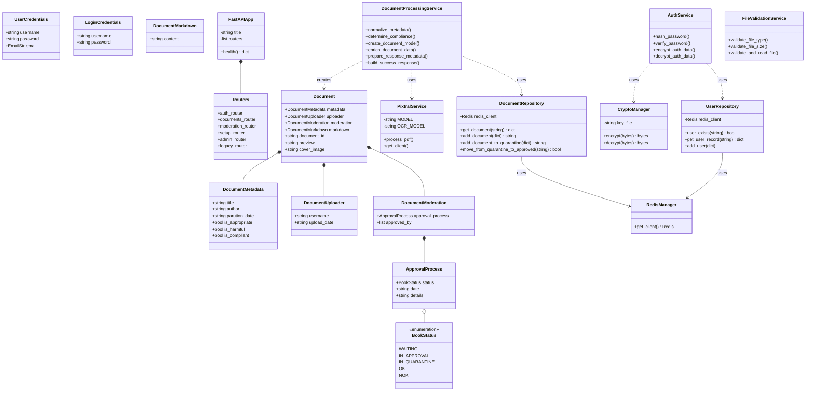

# Diagramme de Classes - Bibliotheko

## Diagramme de Classes

## Description des composants

### 1. Couche API (API Layer)

#### FastAPIApp
Application principale FastAPI ("Bibliotheko API") qui gère la configuration globale et l'agrégation des routeurs.

#### Routers
L'API est découpée en modules :
- **auth_router** : Inscription et connexion.
- **documents_router** : Gestion des documents approuvés.
- **moderation_router** : Flux de modération et quarantaine.
- **setup_router** : Configuration initiale.
- **admin_router** : Administration des utilisateurs.
- **legacy_router** : Endpoint historique `/api/send-book`.

### 2. Modèles de Données (Models)

Basés sur **Pydantic**, ils assurent la validation des données :
- **Document** : Modèle racine contenant les métadonnées, l'uploader, la modération et le contenu.
- **DocumentMetadata** : Informations descriptives et indicateurs de conformité.
- **BookStatus** : Énumération des états possibles d'un document (WAITING, OK, NOK, etc.).

### 3. Services de Domaine (Domain Services)

#### DocumentProcessingService
Gère la logique métier complexe liée aux documents :
- Normalisation des métadonnées issues de l'OCR.
- Détermination de la conformité basée sur les analyses de sécurité et de contenu.
- Construction des modèles et des réponses API.

#### AuthService
Gère la sécurité des comptes :
- Hachage PBKDF2-HMAC-SHA256.
- Chiffrement des données sensibles (hash + salt) avant stockage.

#### FileValidationService
Valide les fichiers PDF (type MIME, taille maximale).

### 4. Infrastructure

#### PixtralService
Interface avec l'API **Mistral AI** pour :
- L'OCR (Mistral OCR).
- L'analyse LLM (Pixtral) pour les métadonnées et la sécurité.

#### CryptoManager
Gère le chiffrement symétrique **Fernet** (AES-128) avec gestion automatique de la clé.

#### RedisManager
Gère la connexion au serveur **Redis**.

### 5. Couche de Stockage (Repositories)

Le stockage a été migré de fichiers JSON vers **Redis** pour plus de performance et de flexibilité :
- **UserRepository** : Stocke les profils utilisateurs sous forme de Hashes Redis.
- **DocumentRepository** : Stocke les documents (JSON sérialisé) et gère les index (Sets Redis) par statut et uploader. Gère également la zone de quarantaine séparée.

## Flux de données principaux

### 1. Inscription d'un utilisateur
`APIRouter` → `AuthService.hash_password` → `AuthService.encrypt_auth_data` → `UserRepository.add_user` → `Redis`.

### 2. Traitement d'un PDF
`APIRouter` → `FileValidationService` → `PixtralService.process_pdf` → `DocumentProcessingService.create_document_model` → `DocumentRepository`.

---

*Dernière mise à jour du diagramme : 2026-01-12*

