# Diagramme de Classes - La Response D

## Vue d'ensemble de l'architecture

Ce document présente le diagramme de classes du projet "La Response D", une application de traitement de documents PDF avec OCR, authentification sécurisée et analyse de contenu.

## Diagramme de Classes

```mermaid
classDiagram
    %% ==================== Modèles de Données ====================
    
    class UserCredentials {
        +string username
        +string password
        +EmailStr email
    }
    
    class LoginCredentials {
        +string username
        +string password
    }
    
    class UserRecord {
        +string username
        +string email
        +string encrypted_auth
    }
    
    class SensitiveData {
        +string password_hash
        +string salt
    }
    
    class Metadata {
        +string title
        +string author
        +string date
        +string publisher
        +string description
    }
    
    class SecurityAnalysis {
        +bool has_security_prompts
        +list detected_prompts
        +string risk_level
        +string details
    }
    
    class ContentAnalysis {
        +bool is_appropriate
        +list content_warnings
        +string severity
        +string details
    }
    
    class ProcessingInfo {
        +string file_name
        +int total_pages
        +int total_text_length
    }
    
    class OCRResult {
        +list pages
        +string model
        +string document_id
    }
    
    class Page {
        +string markdown
        +list images
        +int page_number
    }
    
    class Image {
        +string id
        +string image_base64
    }
    
    %% ==================== API Layer ====================
    
    class APIRouter {
        -string prefix
        -list tags
        +send_book(UploadFile) JSONResponse
        +register_user(UserCredentials) JSONResponse
        +login_user(LoginCredentials) JSONResponse
    }
    
    class FastAPIApp {
        -string title
        -list routers
        +health() dict
        +add_middleware()
    }
    
    %% ==================== Services ====================
    
    class PixtralService {
        -string MODEL
        -string OCR_MODEL
        +process_pdf(string, bytes) dict
        -_extract_metadata(Mistral, string) Metadata
        -_detect_security_prompts(Mistral, string) SecurityAnalysis
        -_check_inappropriate_content(Mistral, string) ContentAnalysis
        -_load_api_key() string
        +get_client() Mistral
    }
    
    class AuthenticationService {
        -Fernet fernet
        -bytes key
        +user_exists(string) bool
        +get_user_record(string) UserRecord
        +load_users() list
        +save_users(list) void
        +hash_password(string, bytes) bytes
        +verify_password(string, bytes, bytes) bool
    }
    
    class EncryptionService {
        -Fernet fernet
        -bytes key
        +generate_key() bytes
        +load_key() bytes
        +save_key(bytes) void
        +encrypt(string) string
        +decrypt(string) string
    }
    
    class FileService {
        -int MAX_SIZE_BYTES
        +validate_file_type(UploadFile) bool
        +validate_file_size(bytes) bool
        +read_file(string) bytes
        +write_file(string, bytes) void
    }
    
    %% ==================== External Services ====================
    
    class Mistral {
        <<External>>
        -string api_key
        +chat.complete(string, list) Response
        +files.upload(dict, string) UploadedFile
        +files.get_signed_url(string) SignedURL
        +ocr.process(string, dict) OCRResult
    }
    
    class Fernet {
        <<External>>
        -bytes key
        +generate_key() bytes
        +encrypt(bytes) bytes
        +decrypt(bytes) bytes
    }
    
    %% ==================== Storage ====================
    
    class UsersRepository {
        -string file_path
        +find_by_username(string) UserRecord
        +save(UserRecord) void
        +find_all() list
        +exists(string) bool
    }
    
    class FileRepository {
        -string key_file
        -string users_file
        +read_json(string) dict
        +write_json(string, dict) void
        +read_bytes(string) bytes
        +write_bytes(string, bytes) void
    }
    
    %% ==================== Relations ====================
    
    FastAPIApp *-- APIRouter : contains
    
    APIRouter ..> UserCredentials : uses
    APIRouter ..> LoginCredentials : uses
    APIRouter ..> OCRResult : returns
    
    APIRouter --> PixtralService : uses
    APIRouter --> AuthenticationService : uses
    APIRouter --> FileService : uses
    
    PixtralService --> Mistral : uses
    PixtralService ..> Metadata : creates
    PixtralService ..> SecurityAnalysis : creates
    PixtralService ..> ContentAnalysis : creates
    PixtralService ..> ProcessingInfo : creates
    
    AuthenticationService --> EncryptionService : uses
    AuthenticationService --> UsersRepository : uses
    AuthenticationService ..> UserRecord : manipulates
    AuthenticationService ..> SensitiveData : manipulates
    
    EncryptionService --> Fernet : uses
    
    UsersRepository --> FileRepository : uses
    
    UserRecord ..> SensitiveData : encrypts
    UserCredentials ..> UserRecord : creates
    LoginCredentials ..> UserRecord : validates
    
    OCRResult *-- Page : contains
    Page *-- Image : contains
```



## Description des composants

### 1. Couche API (API Layer)

#### FastAPIApp
Application principale FastAPI qui gère:
- Configuration CORS
- Enregistrement des routeurs
- Point de terminaison de santé (`/health`)

#### APIRouter
Routeur principal avec préfixe `/api` gérant trois endpoints principaux:
- `POST /api/send-book` : Traitement OCR de documents PDF
- `POST /api/register` : Inscription d'utilisateurs
- `POST /api/login` : Authentification d'utilisateurs

### 2. Modèles de Données (Models)

#### Modèles d'authentification
- **UserCredentials** : Données d'inscription (username, password, email)
- **LoginCredentials** : Données de connexion (username, password)
- **UserRecord** : Enregistrement utilisateur stocké (avec auth chiffrée)
- **SensitiveData** : Données sensibles (hash de mot de passe + salt)

#### Modèles de traitement PDF
- **Metadata** : Métadonnées extraites du document (titre, auteur, date, éditeur, description)
- **SecurityAnalysis** : Analyse de sécurité détectant les prompts suspects
- **ContentAnalysis** : Analyse de contenu inapproprié ou illégal
- **ProcessingInfo** : Informations de traitement (nom de fichier, nombre de pages, longueur de texte)
- **OCRResult** : Résultat complet de l'OCR
- **Page** : Page individuelle avec markdown et images
- **Image** : Image extraite encodée en base64

### 3. Services

#### PixtralService
Service principal pour le traitement des PDF via l'API Mistral:
- **OCR** : Reconnaissance optique de caractères
- **Extraction de métadonnées** : Identification automatique du titre, auteur, etc.
- **Analyse de sécurité** : Détection de prompts d'injection ou de manipulation
- **Analyse de contenu** : Vérification de contenu inapproprié (violence, haine, etc.)
- **Génération de Markdown** : Conversion du PDF en Markdown avec images

**Fonctionnalités clés:**
- Support des images en data URI ou fichiers séparés
- Traitement multipage
- Analyse intelligente via LLM (Mistral)

#### AuthenticationService
Gestion de l'authentification sécurisée:
- **Hachage de mots de passe** : PBKDF2-HMAC-SHA256 avec salt aléatoire (100,000 itérations)
- **Chiffrement** : Données sensibles chiffrées via Fernet (AES-128)
- **Gestion des utilisateurs** : CRUD sur les enregistrements utilisateurs
- **Vérification** : Validation des credentials lors de la connexion

**Sécurité:**
- Salt unique par utilisateur (16 bytes aléatoires)
- Hash stocké en base64
- Données sensibles (hash + salt) chiffrées séparément

#### EncryptionService
Service de chiffrement centralisé:
- **Gestion des clés** : Génération, chargement et sauvegarde de clés Fernet
- **Chiffrement/Déchiffrement** : Opérations cryptographiques via Fernet
- **Clé persistante** : Stockée dans `key.key`

#### FileService
Gestion et validation des fichiers:
- **Validation de type** : Vérification du format PDF
- **Validation de taille** : Limite à 200 MB
- **Opérations I/O** : Lecture et écriture de fichiers

### 4. Services Externes

#### Mistral (Client API externe)
Client pour l'API Mistral AI:
- `chat.complete()` : Génération de texte et analyse via LLM
- `files.upload()` : Upload de documents PDF
- `files.get_signed_url()` : Obtention d'URL signées
- `ocr.process()` : Traitement OCR avec `mistral-ocr-latest`

#### Fernet (Bibliothèque cryptographique)
Chiffrement symétrique via la bibliothèque `cryptography`:
- Algorithme : AES-128 en mode CBC
- Génération de clés sécurisées
- Chiffrement/déchiffrement avec authentification

### 5. Couche de Stockage (Storage)

#### UsersRepository
Repository pour la gestion des utilisateurs:
- Recherche par nom d'utilisateur
- Vérification d'existence
- Sauvegarde et récupération de tous les utilisateurs
- Format de stockage : JSON

#### FileRepository
Repository bas niveau pour opérations fichiers:
- Lecture/écriture JSON
- Lecture/écriture binaire
- Gestion de `users.json` et `key.key`

## Flux de données principaux

### 1. Inscription d'un utilisateur

```
Client → APIRouter.register_user(UserCredentials)
    → AuthenticationService.user_exists()
        → UsersRepository.exists()
            → FileRepository.read_json()
    → AuthenticationService.hash_password()
    → EncryptionService.encrypt(SensitiveData)
        → Fernet.encrypt()
    → UsersRepository.save(UserRecord)
        → FileRepository.write_json()
    → Client (UserRecord créé)
```

### 2. Connexion d'un utilisateur

```
Client → APIRouter.login_user(LoginCredentials)
    → AuthenticationService.get_user_record()
        → UsersRepository.find_by_username()
    → EncryptionService.decrypt()
        → Fernet.decrypt()
    → AuthenticationService.verify_password()
    → Client (Session authentifiée)
```

### 3. Traitement d'un PDF

```
Client → APIRouter.send_book(UploadFile)
    → FileService.validate_file_type()
    → FileService.validate_file_size()
    → PixtralService.process_pdf()
        → Mistral.files.upload()
        → Mistral.files.get_signed_url()
        → Mistral.ocr.process() → OCRResult
        → PixtralService._extract_metadata() → Metadata
        → PixtralService._detect_security_prompts() → SecurityAnalysis
        → PixtralService._check_inappropriate_content() → ContentAnalysis
    → Client (OCRResult + analyses complètes)
```

## Sécurité

### Authentification
- **Hachage** : PBKDF2-HMAC-SHA256 (100,000 itérations)
- **Salt** : 16 bytes aléatoires par utilisateur
- **Encodage** : Base64 URL-safe

### Chiffrement
- **Algorithme** : Fernet (AES-128-CBC + HMAC)
- **Clé** : 256 bits générée aléatoirement
- **Stockage** : Clé persistée dans `key.key`
- **Données chiffrées** : `password_hash` + `salt`

### Validation des fichiers
- **Type** : PDF uniquement (`application/pdf`)
- **Taille** : Maximum 200 MB
- **Contenu** : Analyse automatique de sécurité et de contenu

### Analyse de sécurité
- Détection de prompt injection
- Détection de commandes système cachées
- Détection de manipulation d'IA
- Classification par niveau de risque (low/medium/high)

### Analyse de contenu
- Détection de contenu violent ou haineux
- Détection de contenu sexuel inapproprié
- Détection d'incitation à la violence
- Détection de contenu discriminatoire
- Classification par sévérité (none/low/medium/high)

## Technologies utilisées

- **Framework Web** : FastAPI
- **Validation** : Pydantic
- **Cryptographie** : cryptography (Fernet)
- **Hachage** : hashlib (PBKDF2-HMAC-SHA256)
- **OCR & IA** : Mistral AI (pixtral-large-latest, mistral-ocr-latest)
- **Stockage** : JSON (fichiers locaux)
- **CORS** : Middleware FastAPI

## Points d'amélioration possibles

1. **Base de données** : Remplacer le stockage JSON par PostgreSQL/MongoDB
2. **JWT** : Implémenter des tokens JWT pour l'authentification stateless
3. **Sessions** : Gestion de sessions avec Redis
4. **Rate limiting** : Protection contre les abus d'API
5. **Logging** : Système de logs structurés (ELK, Datadog)
6. **Cache** : Mise en cache des résultats OCR fréquents
7. **Queue** : File d'attente pour le traitement asynchrone de gros PDF (Celery/RabbitMQ)
8. **Tests** : Tests unitaires et d'intégration complets
9. **Observabilité** : Métriques et tracing (Prometheus, Grafana, OpenTelemetry)
10. **Stockage fichiers** : S3/MinIO pour les fichiers uploadés

## Fichiers du projet

- **API** : `/server/src/app/api/__init__.py`
- **Service OCR** : `/server/src/app/api/pixtral.py`
- **App principale** : `/server/src/app/main.py`
- **Routes** : `/server/src/app/routes.py`
- **Clé de chiffrement** : `/server/src/key.key`
- **Utilisateurs** : `/server/src/users.json` (généré)
- **Configuration API** : `/server/src/app/api/apikey.json`

---

*Diagramme généré le 2025-11-03*

