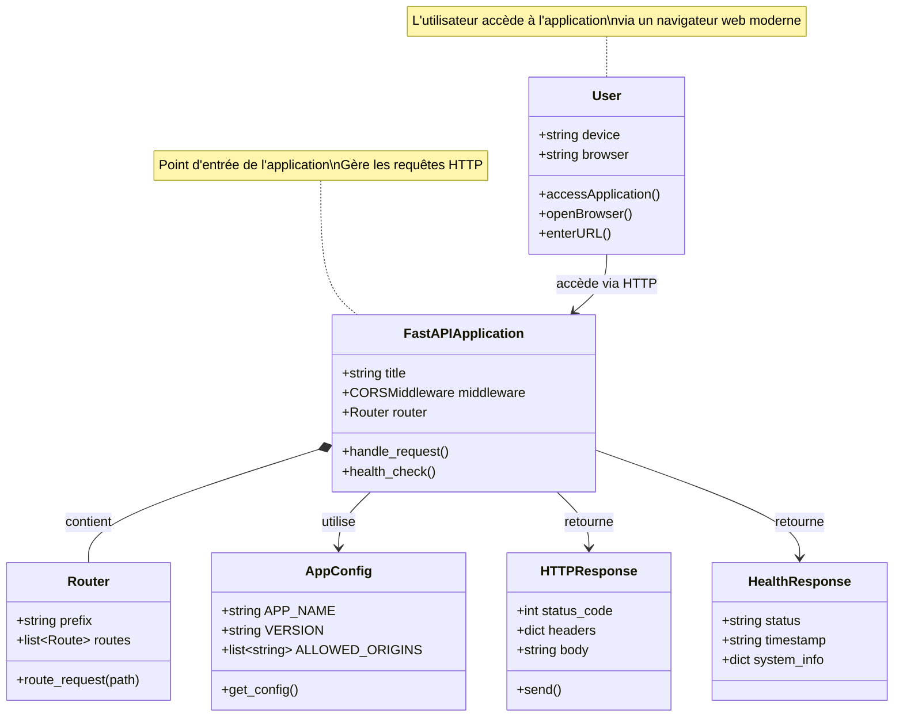

# Scénario 1 : Accès à l'application web

## Diagramme de classes

## Description

Ce diagramme représente les classes impliquées lors de l'accès initial à l'application web.

### Classes principales

#### User (Acteur)
- Représente l'utilisateur qui accède à l'application
- Possède un appareil (device) et un navigateur (browser)
- Peut accéder à l'application via une URL

#### FastAPIApplication
- Point d'entrée principal de l'application
- Configure le middleware CORS pour permettre l'accès web
- Contient un routeur pour diriger les requêtes
- Fournit un endpoint de santé (/health)

#### Router
- Gère le routage des requêtes vers les endpoints appropriés
- Préfixe : /api
- Contient toutes les routes disponibles

#### AppConfig
- Configuration centralisée de l'application
- Définit les origines autorisées (CORS)
- Contient les paramètres globaux

#### HTTPResponse / HealthResponse
- Réponses retournées au client
- HealthResponse confirme que l'application fonctionne

## Flux d'exécution

1. L'utilisateur ouvre son navigateur
2. L'utilisateur entre l'URL de l'application
3. FastAPIApplication reçoit la requête HTTP
4. Le Router achemine la requête vers le bon endpoint
5. Une HTTPResponse est générée et retournée
6. L'utilisateur reçoit la page web

## Fichiers sources

- `/server/src/app/main.py` - FastAPIApplication
- `/server/src/app/api/routes.py` - Router
- `/server/src/app/infra/config/app_config.py` - AppConfig

