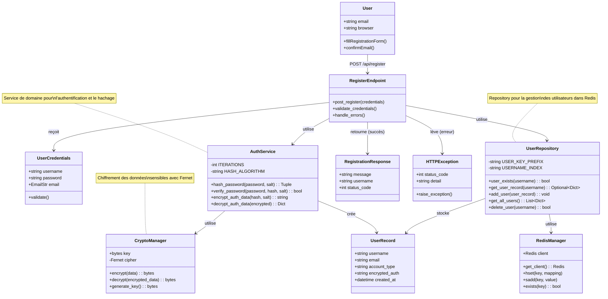

# Scénario 2 : Devenir Membre

## Diagramme de classes

## Description

Ce diagramme représente les classes impliquées dans le processus d'inscription d'un nouveau membre.

### Classes principales

#### User (Acteur)
- Représente l'utilisateur qui souhaite s'inscrire
- Fournit ses informations (username, email, password)
- Confirme son inscription via email

#### RegisterEndpoint (API)
- Endpoint `/api/register` (POST)
- Valide les credentials reçus
- Coordonne le processus d'inscription
- Gère les erreurs (username existant, etc.)

#### UserCredentials (Model)
- Modèle Pydantic pour la validation des données
- Champs : username, password, email
- Validation automatique du format email

#### AuthService (Domain Service)
- Service métier pour l'authentification
- Hache les mots de passe avec PBKDF2 (100,000 itérations)
- Génère et utilise des salts aléatoires
- Chiffre les données d'authentification
- Algorithme : SHA-256

#### CryptoManager (Infrastructure)
- Gestionnaire de chiffrement Fernet (AES-128)
- Charge la clé depuis `key.key`
- Chiffre et déchiffre les données sensibles

#### UserRepository (Infrastructure)
- Repository pour les opérations sur les utilisateurs
- Utilise Redis comme base de données
- Préfixe des clés : `user:{username}`
- Index : `usernames` (set de tous les usernames)
- Opérations : add_user, user_exists, get_user_record

#### RedisManager (Infrastructure)
- Gestionnaire de connexion Redis
- Fournit le client Redis
- Gère les opérations HSET, SADD, EXISTS

#### UserRecord
- Structure de données de l'utilisateur enregistré
- Contient les données chiffrées (encrypted_auth)
- Type de compte par défaut : "USER"

### Flux d'exécution

1. L'utilisateur remplit le formulaire d'inscription
2. Le frontend envoie POST /api/register avec UserCredentials
3. RegisterEndpoint valide que le username n'existe pas
4. AuthService génère un salt et hache le mot de passe
5. AuthService chiffre les données d'authentification
6. Un UserRecord est créé avec les données chiffrées
7. UserRepository stocke l'utilisateur dans Redis
8. Une RegistrationResponse est retournée

### Sécurité

- **Hachage** : PBKDF2-SHA256 avec 100,000 itérations
- **Salt** : Aléatoire de 32 bytes pour chaque utilisateur
- **Chiffrement** : Fernet (AES-128) pour encrypted_auth
- **Validation** : EmailStr valide le format email

### Gestion des erreurs

- **Username existant** : HTTPException 400
- **Erreur Redis** : HTTPException 500
- **Format invalide** : Validation Pydantic automatique

## Fichiers sources

- `/server/src/app/api/routes.py` - RegisterEndpoint
- `/server/src/app/api/models.py` - UserCredentials, UserRecord
- `/server/src/app/domain/services/auth_service.py` - AuthService
- `/server/src/app/infra/security/crypto_manager.py` - CryptoManager
- `/server/src/app/infra/repositories/user_repository.py` - UserRepository
- `/server/src/app/infra/database/redis_manager.py` - RedisManager

