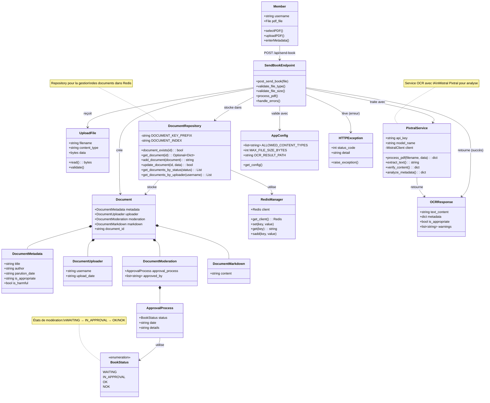

# Scénario 3 : Numériser et Proposer une Œuvre

## Diagramme de classes

## Description

Ce diagramme représente les classes impliquées dans le processus de numérisation et de proposition d'une œuvre par un membre.

### Classes principales

#### Member (Acteur)
- Membre authentifié souhaitant partager une œuvre
- Possède un fichier PDF de l'œuvre numérisée
- Fournit les métadonnées de base

#### SendBookEndpoint (API)
- Endpoint `/api/send-book` (POST)
- Accepte des fichiers UploadFile (multipart/form-data)
- Valide le type de fichier (PDF uniquement)
- Limite de taille : 200 Mo (209,715,200 bytes)
- Coordonne le traitement OCR et le stockage

#### UploadFile (FastAPI)
- Représente le fichier uploadé
- Propriétés : filename, content_type, data
- Validation automatique par FastAPI

#### Document (Model)
- Modèle complet d'un document dans le système
- Composé de 4 parties principales :
  - **metadata** : Informations sur l'œuvre
  - **uploader** : Qui a uploadé et quand
  - **moderation** : État de validation
  - **markdown** : Contenu au format Markdown
- Possède un document_id unique

#### DocumentMetadata
- Informations sur l'œuvre
- title, author, parution_date
- is_appropriate : évalué par l'IA
- is_harmful : détection de contenu inapproprié

#### DocumentModeration
- Gestion du processus de modération
- approval_process : état actuel (WAITING, IN_APPROVAL, OK, NOK)
- approved_by : liste des modérateurs ayant approuvé
- Nécessite 3 approbations pour passer à OK

#### BookStatus (Enum)
- **WAITING** : En attente de modération
- **IN_APPROVAL** : En cours de modération
- **OK** : Validé et publié
- **NOK** : Rejeté

#### PixtralService (Infrastructure)
- Service d'OCR utilisant Mistral AI Pixtral
- Traite les PDF page par page
- Extrait le texte et analyse la structure
- Vérifie les métadonnées et le contenu
- Détecte les anomalies ou contenus inappropriés
- Génère le contenu au format Markdown

#### DocumentRepository (Infrastructure)
- Repository pour les opérations sur les documents
- Utilise Redis comme base de données
- Préfixe des clés : `document:{document_id}`
- Index : `document_ids` (set de tous les IDs)
- Index par statut : `documents:status:{status}`
- Index par uploader : `documents:uploader:{username}`
- Génère des IDs uniques : `doc_{timestamp}_{counter}`

#### AppConfig
- Configuration pour la validation des uploads
- Types autorisés : ["application/pdf"]
- Taille max : 200 Mo
- Chemin de sauvegarde des résultats OCR

### Flux d'exécution

1. Le membre sélectionne un fichier PDF
2. Le membre upload le fichier via POST /api/send-book
3. SendBookEndpoint valide le type (PDF) et la taille (≤200 Mo)
4. Le fichier est envoyé à PixtralService pour traitement OCR
5. PixtralService extrait le texte, analyse le contenu et les métadonnées
6. Un Document est créé avec :
   - metadata extraites par l'IA
   - uploader info (username, date)
   - moderation (status=WAITING)
   - markdown généré par OCR
7. DocumentRepository génère un ID unique et stocke le document
8. Le document est ajouté aux index (document_ids, documents:status:WAITING)
9. Une OCRResponse est retournée avec les résultats

### Validation et contrôles

- **Type de fichier** : Uniquement PDF
- **Taille** : Maximum 200 Mo
- **Contenu** : Analyse IA pour détecter :
  - Contenu inapproprié
  - Métadonnées manquantes
  - Qualité du scan
  - Conformité légale

### Gestion des erreurs

- **Type invalide** : HTTPException 400 "Type de fichier non supporté"
- **Fichier trop volumineux** : HTTPException 413 "Fichier trop volumineux"
- **Échec OCR** : HTTPException 500 "Échec du traitement OCR"
- **Erreur Redis** : HTTPException 500

### Dossiers de stockage

Selon les métadonnées et l'analyse :
- `data/a_moderer/` : Documents nécessitant une modération manuelle
- `data/fond_commun/` : Documents du domaine public validés
- `data/emprunts/` : Documents sous droits d'auteur

## Fichiers sources

- `/server/src/app/api/routes.py` - SendBookEndpoint
- `/server/src/app/api/models.py` - Document, DocumentMetadata, BookStatus
- `/server/src/app/infra/ocr/pixtral_service.py` - PixtralService
- `/server/src/app/infra/repositories/document_repository.py` - DocumentRepository
- `/server/src/app/infra/database/redis_manager.py` - RedisManager
- `/server/src/app/infra/config/app_config.py` - AppConfig

