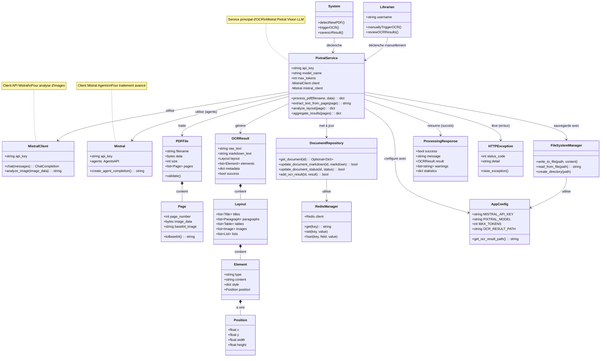

# Scénario 4 : Reconnaissance de Texte d'une Œuvre (OCR)

## Diagramme de classes

## Description

Ce diagramme représente les classes impliquées dans le processus de reconnaissance optique de caractères (OCR) d'une œuvre numérisée.

### Classes principales

#### System (Acteur)
- Système automatique qui détecte les nouveaux PDF
- Déclenche le processus OCR automatiquement
- Sauvegarde les résultats dans la base de données

#### Librarian (Acteur)
- Peut déclencher manuellement l'OCR
- Révise les résultats de l'OCR
- Corrige les erreurs éventuelles

#### PixtralService (Infrastructure)
- Service principal d'OCR utilisant Mistral AI
- **Modèle** : Pixtral Vision LLM
- **Capacités** :
  - Analyse d'images de pages PDF
  - Extraction de texte
  - Reconnaissance de la mise en page
  - Identification des éléments (titres, paragraphes, tableaux, images)
  - Génération de Markdown structuré
- **Configuration** :
  - max_tokens : limite de tokens par requête
  - model_name : "pixtral-12b-2409" ou similaire

#### MistralClient
- Client API Mistral pour l'analyse d'images
- Envoie les images en base64
- Reçoit le texte extrait et l'analyse structurelle

#### Mistral (Agents)
- Client Mistral pour les agents IA
- Utilisé pour un traitement avancé
- Peut orchestrer plusieurs analyses

#### PDFFile
- Représentation d'un fichier PDF
- Contient une liste de pages
- Validation du format et de l'intégrité

#### Page
- Représente une page du PDF
- Contient l'image de la page
- Convertie en base64 pour l'envoi à l'API

#### OCRResult
- Résultat complet du traitement OCR
- **raw_text** : texte brut extrait
- **markdown_text** : texte formaté en Markdown
- **layout** : structure de la page
- **elements** : liste des éléments identifiés
- **metadata** : informations supplémentaires
- **success** : indicateur de réussite

#### Layout
- Structure de la mise en page
- Contient des listes d'éléments par type :
  - titles : titres et sous-titres
  - paragraphs : paragraphes de texte
  - tables : tableaux
  - images : images et figures
  - lists : listes à puces ou numérotées

#### Element
- Élément individuel de la page
- **type** : type d'élément (title, paragraph, table, etc.)
- **content** : contenu textuel
- **style** : informations de style (gras, italique, etc.)
- **position** : position sur la page

#### Position
- Position et dimensions d'un élément
- Coordonnées (x, y) et taille (width, height)
- Permet de reconstituer la mise en page originale

#### DocumentRepository
- Repository pour mettre à jour les documents
- Stocke le résultat OCR dans Redis
- Met à jour le statut du document
- Associe le Markdown généré au document

#### FileSystemManager
- Gère la sauvegarde des résultats sur disque
- Écrit dans `ocr_result.txt`
- Chemin configuré dans AppConfig

#### AppConfig
- Configuration pour le service OCR
- Clé API Mistral
- Nom du modèle Pixtral
- Limite de tokens
- Chemin de sauvegarde des résultats

### Flux d'exécution

1. Le système détecte un nouveau PDF ou un libraire déclenche l'OCR
2. PixtralService reçoit le PDFFile
3. Pour chaque Page du PDF :
   a. La page est convertie en base64
   b. MistralClient envoie l'image à l'API Mistral
   c. L'IA analyse l'image et extrait le texte
   d. L'IA identifie la structure (titres, paragraphes, etc.)
4. PixtralService agrège les résultats de toutes les pages
5. Le texte est structuré en Markdown
6. Un OCRResult complet est généré avec :
   - Texte brut et Markdown
   - Layout avec tous les éléments
   - Métadonnées (nombre de pages, qualité, etc.)
7. DocumentRepository met à jour le document dans Redis
8. FileSystemManager sauvegarde le résultat dans un fichier
9. Le statut du document passe à "OCR effectué"
10. Une ProcessingResponse est retournée

### Processus d'analyse

#### Étape 1 : Extraction de texte
- Reconnaissance des caractères
- Gestion des différentes polices
- Détection de l'orientation du texte

#### Étape 2 : Analyse de la mise en page
- Identification des zones de texte
- Détection des colonnes
- Reconnaissance des en-têtes et pieds de page

#### Étape 3 : Classification des éléments
- Titres (H1, H2, H3, etc.)
- Paragraphes normaux
- Listes (à puces, numérotées)
- Tableaux
- Images et légendes
- Notes de bas de page

#### Étape 4 : Génération Markdown
- Conversion des éléments en syntaxe Markdown
- Préservation de la hiérarchie
- Gestion des tableaux complexes
- Intégration des images (références)

### Gestion des erreurs

- **PDF corrompu** : HTTPException 400 "Fichier PDF invalide"
- **Échec API Mistral** : HTTPException 500 "Échec du traitement OCR"
- **Limite de tokens dépassée** : Découpage en chunks
- **Qualité insuffisante** : Avertissement dans les warnings

### Optimisations

- **Traitement par lots** : Plusieurs pages envoyées ensemble
- **Cache** : Résultats intermédiaires sauvegardés
- **Retry** : Réessai automatique en cas d'erreur temporaire

### Métriques de qualité

Le ProcessingResponse inclut des statistiques :
- Nombre de pages traitées
- Temps de traitement
- Confiance moyenne (0-100%)
- Nombre d'éléments détectés
- Warnings et erreurs

## Fichiers sources

- `/server/src/app/infra/ocr/pixtral_service.py` - PixtralService
- `/server/src/app/api/routes.py` - Integration avec send-book endpoint
- `/server/src/app/infra/repositories/document_repository.py` - DocumentRepository
- `/server/src/app/infra/config/app_config.py` - AppConfig

## API Mistral utilisée

- **Endpoint** : `https://api.mistral.ai/v1/chat/completions`
- **Modèle** : `pixtral-12b-2409`
- **Format d'entrée** : Images en base64
- **Format de sortie** : JSON avec texte et structure

