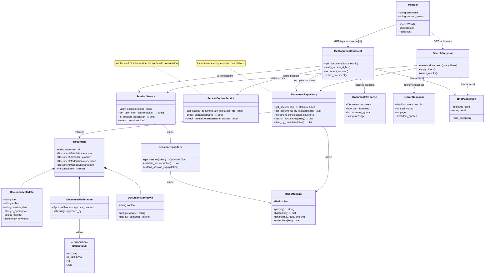

# Scénario 5 : Consulter une Œuvre

## Diagramme de classes



## Description

Ce diagramme représente les classes impliquées dans le processus de consultation d'une œuvre par un membre.

### Classes principales

#### Member (Acteur)
- Membre authentifié souhaitant consulter une œuvre
- Possède un token de session valide
- Peut rechercher et sélectionner des livres

#### GetDocumentEndpoint (API)
- Endpoint `/api/documents/{document_id}` (GET)
- Vérifie l'authentification via le token
- Vérifie les droits d'accès au document
- Incrémente le compteur de consultations
- Retourne le document complet

#### SearchEndpoint (API)
- Endpoint `/api/search` (GET)
- Permet de rechercher des documents
- Accepte des paramètres de requête et des filtres
- Retourne une liste de résultats paginés

#### Document (Model)
- Modèle complet d'un document
- Contient toutes les informations du livre
- **consultation_counter** : nombre de fois où le livre a été consulté
- Seuls les documents avec status=OK sont accessibles

#### DocumentMetadata
- Métadonnées du document
- Utilisées pour la recherche et le filtrage
- keywords : mots-clés pour faciliter la recherche

#### DocumentMarkdown
- Contenu du document au format Markdown
- **get_preview()** : retourne un aperçu (premières pages)
- **get_full_content()** : retourne le contenu complet

#### SessionService (Domain Service)
- Service métier pour la gestion des sessions
- Vérifie la validité d'un token de session
- Récupère l'utilisateur associé à une session
- Prolonge la durée de vie d'une session

#### AccessControlService (Domain Service)
- Service métier pour le contrôle d'accès
- Vérifie si un utilisateur peut accéder à un document
- Vérifie les quotas de consultation
- Gère les permissions par rôle (USER, LIBRARIAN, etc.)

#### DocumentRepository (Infrastructure)
- Repository pour les opérations sur les documents
- **get_document(id)** : récupère un document par son ID
- **get_documents_by_status(status)** : filtre par statut (OK uniquement pour consultation)
- **increment_consultation_counter(id)** : incrémente le compteur
- **search_documents(query)** : recherche par mots-clés
- **filter_by_metadata(filters)** : filtre par auteur, date, etc.

#### SessionRepository (Infrastructure)
- Repository pour les opérations sur les sessions
- Utilise Redis pour stocker les sessions
- Clés : `session:{token}`
- Expiration automatique après inactivité

#### RedisManager
- Gestionnaire de connexion Redis
- **hincrby** : incrémente un champ numérique (compteur)
- **smembers** : récupère les membres d'un set (pour les index)

### Flux d'exécution

#### 1. Recherche d'une œuvre

1. Le membre envoie GET /api/search?query=titre&author=auteur
2. SearchEndpoint vérifie la session avec SessionService
3. DocumentRepository recherche dans Redis :
   - Index de recherche par titre et auteur
   - Filtre par status=OK (uniquement les livres validés)
4. Les résultats sont filtrés selon les critères
5. Une SearchResponse paginée est retournée

#### 2. Sélection et consultation

1. Le membre clique sur un livre et envoie GET /api/documents/{id}
2. GetDocumentEndpoint vérifie la session
3. AccessControlService vérifie :
   - L'utilisateur est authentifié
   - Le document existe et est accessible (status=OK)
   - L'utilisateur n'a pas dépassé son quota
4. DocumentRepository récupère le document complet
5. DocumentRepository incrémente consultation_counter
6. Le document est retourné dans une DocumentResponse avec :
   - Document complet avec markdown
   - Indicateur can_download
   - Quota restant
7. Le membre peut lire le livre en ligne ou le télécharger

### Contrôle d'accès

#### Vérifications effectuées

1. **Session valide** : Token non expiré
2. **Document disponible** : Status = OK
3. **Quota** : Nombre de consultations/emprunts autorisés
4. **Permissions** : Rôle de l'utilisateur (si documents restreints)

#### Quotas de consultation

- **Membres standard** : Limité (ex: 5 consultations simultanées)
- **Membres premium** : Illimité
- **Libraires** : Accès complet sans restriction

### Compteur de consultations

Le compteur est incrémenté à chaque consultation pour :
- Statistiques d'utilisation
- Popularité des œuvres
- Recommandations futures

Stocké dans Redis :
```
HINCRBY document:{id} consultation_counter 1
```

### Gestion des erreurs

- **Session invalide** : HTTPException 401 "Non authentifié"
- **Document inexistant** : HTTPException 404 "Document non trouvé"
- **Accès refusé** : HTTPException 403 "Accès interdit"
- **Quota dépassé** : HTTPException 429 "Quota de consultation dépassé"
- **Document non validé** : HTTPException 403 "Document en attente de validation"

### Format de réponse

#### DocumentResponse
```json
{
  "document": {
    "document_id": "doc_20240117_123",
    "metadata": {
      "title": "Le Petit Prince",
      "author": "Antoine de Saint-Exupéry",
      "parution_date": "1943"
    },
    "markdown": {
      "content": "# Chapitre 1\n\nLorsque j'avais six ans..."
    },
    "consultation_counter": 42
  },
  "can_download": true,
  "remaining_quota": 4,
  "message": "Document accessible"
}
```

#### SearchResponse
```json
{
  "results": [
    {
      "document_id": "doc_20240117_123",
      "metadata": {
        "title": "Le Petit Prince",
        "author": "Antoine de Saint-Exupéry"
      }
    }
  ],
  "total_count": 1,
  "page": 1,
  "filters_applied": {
    "query": "petit prince",
    "status": "OK"
  }
}
```

### Optimisations

- **Cache** : Documents fréquemment consultés en cache
- **Pagination** : Résultats de recherche paginés
- **Index** : Index Redis pour recherche rapide
- **Lazy loading** : Chargement progressif du contenu

## Fichiers sources

- `/server/src/app/api/routes.py` - GetDocumentEndpoint, SearchEndpoint
- `/server/src/app/api/models.py` - Document, DocumentResponse
- `/server/src/app/domain/services/session_service.py` - SessionService
- `/server/src/app/infra/repositories/document_repository.py` - DocumentRepository
- `/server/src/app/infra/database/redis_manager.py` - RedisManager

## Endpoints API

- `GET /api/documents/{document_id}` - Récupérer un document
- `GET /api/search?query={query}&author={author}&year={year}` - Rechercher des documents
- `GET /api/documents/{document_id}/preview` - Aperçu d'un document

