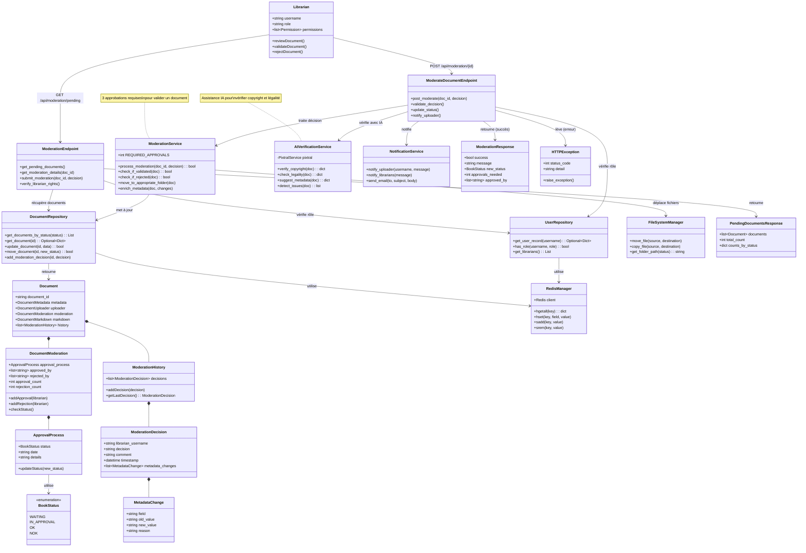

# Scénario 6 : Modérer une Œuvre

## Diagramme de classes



## Description

Ce diagramme représente les classes impliquées dans le processus de modération d'une œuvre par un libraire.

### Classes principales

#### Librarian (Acteur)
- Utilisateur avec des droits de modération
- Rôle : "LIBRARIAN" ou "MODERATOR"
- Peut valider ou rejeter des documents
- Peut enrichir les métadonnées

#### ModerationEndpoint (API)
- Endpoint `/api/moderation/pending` (GET)
- Liste les documents en attente de modération
- Filtre par statut : WAITING, IN_APPROVAL
- Retourne les détails d'un document à modérer

#### ModerateDocumentEndpoint (API)
- Endpoint `/api/moderation/{document_id}` (POST)
- Reçoit une décision de modération
- Décisions possibles : APPROVE, REJECT, REQUEST_CHANGES
- Met à jour le statut du document
- Notifie l'uploader

#### Document (Model)
- Document complet avec historique de modération
- Liste des décisions de modération
- Compteurs d'approbations et de rejets

#### DocumentModeration
- Gestion du processus de modération
- **approval_count** : nombre d'approbations (max 3)
- **rejection_count** : nombre de rejets
- **approved_by** : liste des libraires ayant approuvé
- **rejected_by** : liste des libraires ayant rejeté
- Logique : 3 approbations → OK, 1 rejet → NOK

#### ApprovalProcess
- État actuel du processus de validation
- Statut (WAITING → IN_APPROVAL → OK/NOK)
- Date de dernière modification
- Détails sur les actions effectuées

#### BookStatus (Enum)
- **WAITING** : En attente de première modération
- **IN_APPROVAL** : En cours de modération (1-2 approbations)
- **OK** : Validé (3 approbations)
- **NOK** : Rejeté (1 rejet suffit)

#### ModerationDecision
- Décision individuelle d'un libraire
- **librarian_username** : qui a pris la décision
- **decision** : APPROVE, REJECT, REQUEST_CHANGES
- **comment** : justification
- **timestamp** : quand
- **metadata_changes** : modifications apportées

#### MetadataChange
- Modification d'une métadonnée
- field : champ modifié (title, author, etc.)
- old_value / new_value : avant/après
- reason : pourquoi la modification

#### ModerationHistory
- Historique complet des décisions
- Liste chronologique de toutes les décisions
- Permet de suivre l'évolution du document

#### ModerationService (Domain Service)
- Service métier pour la logique de modération
- **REQUIRED_APPROVALS = 3** : nombre d'approbations nécessaires
- **process_moderation()** : traite une décision
- **check_if_validated()** : vérifie si 3 approbations
- **check_if_rejected()** : vérifie si 1 rejet
- **move_to_appropriate_folder()** : déplace le fichier
- **enrich_metadata()** : applique les changements

#### AIVerificationService (Domain Service)
- Service d'assistance IA pour la modération
- **verify_copyright()** : vérifie les droits d'auteur
- **check_legality()** : vérifie la conformité légale
- **suggest_metadata()** : suggère des métadonnées
- **detect_issues()** : détecte les problèmes potentiels
- Utilise PixtralService pour l'analyse

#### NotificationService (Domain Service)
- Service de notification
- Notifie l'uploader du résultat
- Notifie les autres libraires si nécessaire
- Peut envoyer des emails

#### DocumentRepository (Infrastructure)
- **get_documents_by_status()** : récupère les documents à modérer
- **update_document()** : met à jour les données
- **move_document()** : change le statut
- **add_moderation_decision()** : ajoute une décision
- Index : `documents:status:WAITING`, `documents:status:IN_APPROVAL`

#### UserRepository (Infrastructure)
- **has_role()** : vérifie le rôle d'un utilisateur
- **get_librarians()** : liste tous les libraires
- Utilisé pour vérifier les droits de modération

#### FileSystemManager (Infrastructure)
- Gère le déplacement des fichiers
- Dossiers :
  - `data/a_moderer/` → documents WAITING
  - `data/fond_commun/` → documents OK (domaine public)
  - `data/emprunts/` → documents OK (sous droits)

### Flux d'exécution

#### 1. Consultation de la liste

1. Le libraire envoie GET /api/moderation/pending
2. ModerationEndpoint vérifie le rôle avec UserRepository
3. DocumentRepository récupère les documents avec status=WAITING ou IN_APPROVAL
4. PendingDocumentsResponse retourne la liste avec compteurs

#### 2. Examen d'un document

1. Le libraire sélectionne un document
2. ModerationEndpoint retourne les détails complets :
   - Métadonnées actuelles
   - Contenu PDF (preview)
   - Historique de modération
   - Suggestions de l'IA

#### 3. Vérification avec IA

1. AIVerificationService analyse le document :
   - Copyright : domaine public ou sous droits ?
   - Légalité : contenu approprié ?
   - Métadonnées : suggestions d'enrichissement
   - Problèmes détectés : qualité, complétude, etc.

#### 4. Décision de modération

1. Le libraire prend une décision : APPROVE, REJECT, ou REQUEST_CHANGES
2. Le libraire peut enrichir les métadonnées (ISBN, description, keywords)
3. Le libraire ajoute un commentaire
4. POST /api/moderation/{id} avec ModerationDecision

#### 5. Traitement de la décision

1. ModerateDocumentEndpoint vérifie les droits
2. ModerationService traite la décision :
   - Si APPROVE :
     - Ajoute le libraire à approved_by
     - Incrémente approval_count
     - Si approval_count = 3 : status = OK
     - Sinon : status = IN_APPROVAL
   - Si REJECT :
     - Ajoute le libraire à rejected_by
     - status = NOK immédiatement
   - Si REQUEST_CHANGES :
     - status reste WAITING
     - Notification à l'uploader
3. DocumentRepository met à jour le document
4. ModerationHistory enregistre la décision

#### 6. Finalisation

Si status = OK :
- FileSystemManager déplace le fichier vers le dossier approprié
- NotificationService notifie l'uploader du succès
- Le document devient accessible aux membres

Si status = NOK :
- NotificationService notifie l'uploader du rejet
- Le document est archivé ou supprimé

### Règles de modération

#### Validation (OK)
- Nécessite **3 approbations** de 3 libraires différents
- Tous les libraires doivent être d'accord sur les métadonnées
- Aucun problème légal ou de copyright détecté

#### Rejet (NOK)
- Un seul rejet suffit
- Motifs de rejet :
  - Copyright non respecté
  - Contenu inapproprié ou illégal
  - Qualité insuffisante (scan illisible)
  - Métadonnées incorrectes et non corrigées

#### Modifications demandées
- Le libraire peut demander à l'uploader de corriger
- Le document reste en WAITING
- L'uploader reçoit les instructions de correction

### Enrichissement des métadonnées

Le libraire peut ajouter/corriger :
- **ISBN** : numéro international
- **Description détaillée** : résumé
- **Keywords** : mots-clés pour la recherche
- **Catégorie** : classification
- **Édition** : information d'édition
- **Langue** : langue du document

### Gestion des erreurs

- **Droits insuffisants** : HTTPException 403 "Accès interdit"
- **Document inexistant** : HTTPException 404 "Document non trouvé"
- **Document déjà modéré** : HTTPException 400 "Document déjà validé/rejeté"
- **Libraire a déjà voté** : HTTPException 400 "Vous avez déjà modéré ce document"
- **Décision invalide** : HTTPException 400 "Décision invalide"

### Format de requête

```json
{
  "decision": "APPROVE",
  "comment": "Document conforme, métadonnées vérifiées",
  "metadata_changes": [
    {
      "field": "author",
      "old_value": "Victor Hugo",
      "new_value": "Victor Marie Hugo",
      "reason": "Nom complet"
    }
  ]
}
```

### Format de réponse

```json
{
  "success": true,
  "message": "Approbation enregistrée",
  "new_status": "IN_APPROVAL",
  "approvals_needed": 1,
  "approved_by": ["librarian1", "librarian2"]
}
```

### Statistiques de modération

Le système peut fournir :
- Nombre de documents en attente
- Temps moyen de modération
- Taux d'approbation/rejet
- Nombre de modérations par libraire

## Fichiers sources

- `/server/src/app/api/routes.py` - ModerationEndpoint, ModerateDocumentEndpoint
- `/server/src/app/api/models.py` - Document, DocumentModeration, BookStatus
- `/server/src/app/infra/repositories/document_repository.py` - DocumentRepository
- `/server/src/app/infra/repositories/user_repository.py` - UserRepository
- `/server/src/app/infra/ocr/pixtral_service.py` - AIVerificationService

## Endpoints API

- `GET /api/moderation/pending` - Liste des documents à modérer
- `GET /api/moderation/{document_id}` - Détails d'un document
- `POST /api/moderation/{document_id}` - Soumettre une décision
- `GET /api/moderation/statistics` - Statistiques de modération

