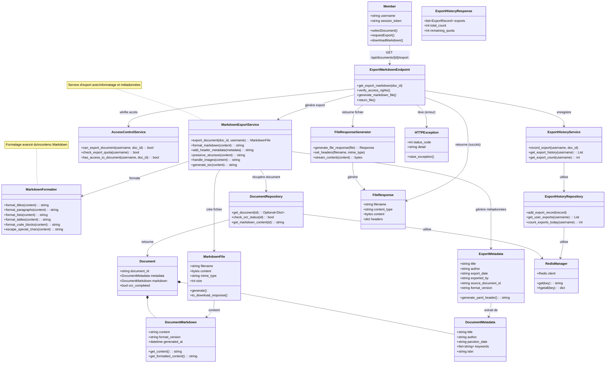

# Scénario 7 : Exporter une Œuvre au Format Markdown

## Diagramme de classes



## Description

Ce diagramme représente les classes impliquées dans le processus d'exportation d'une œuvre au format Markdown.

### Classes principales

#### Member (Acteur)
- Membre authentifié souhaitant exporter une œuvre
- Possède les droits d'accès au document
- Peut télécharger le fichier Markdown généré

#### ExportMarkdownEndpoint (API)
- Endpoint `/api/documents/{document_id}/export` (GET)
- Vérifie l'authentification et les droits d'accès
- Génère le fichier Markdown avec métadonnées
- Retourne le fichier pour téléchargement
- Enregistre l'export dans l'historique

#### Document (Model)
- Document complet avec contenu Markdown
- **ocr_completed** : indique si l'OCR est terminé
- Seuls les documents avec OCR terminé peuvent être exportés

#### DocumentMarkdown
- Contenu Markdown du document
- **content** : texte au format Markdown
- **format_version** : version du format (ex: "1.0")
- **generated_at** : date de génération OCR
- Méthodes pour récupérer le contenu brut ou formaté

#### DocumentMetadata
- Métadonnées du document
- Utilisées pour générer l'en-tête du fichier exporté
- Incluent titre, auteur, date, ISBN, etc.

#### ExportMetadata
- Métadonnées d'export
- Générées lors de chaque export
- Contiennent :
  - Informations du document (titre, auteur)
  - Date et utilisateur de l'export
  - ID du document source
  - Version du format
- **generate_yaml_header()** : génère l'en-tête YAML front-matter

#### MarkdownFile
- Représente le fichier Markdown exporté
- **filename** : nom du fichier (ex: "le-petit-prince.md")
- **content** : contenu complet en bytes
- **mime_type** : "text/markdown"
- **size** : taille en bytes
- Prêt pour le téléchargement

#### MarkdownExportService (Domain Service)
- Service métier pour l'export Markdown
- **export_document()** : orchestre tout le processus
- **format_markdown()** : applique le formatage
- **add_header_metadata()** : ajoute l'en-tête YAML
- **preserve_structure()** : préserve la structure (chapitres, sections)
- **handle_images()** : gère les références aux images
- **generate_toc()** : génère une table des matières

#### MarkdownFormatter
- Service de formatage du contenu Markdown
- **format_titles()** : formate les titres (#, ##, ###)
- **format_paragraphs()** : formate les paragraphes
- **format_lists()** : formate les listes (- item, 1. item)
- **format_tables()** : formate les tableaux
- **format_code_blocks()** : formate les blocs de code
- **escape_special_chars()** : échappe les caractères spéciaux

#### AccessControlService (Domain Service)
- Service de contrôle d'accès
- **can_export_document()** : vérifie si l'utilisateur peut exporter
- **check_export_quota()** : vérifie le quota d'exports
- **has_access_to_document()** : vérifie l'accès au document

#### ExportHistoryService (Domain Service)
- Service de gestion de l'historique d'exports
- **record_export()** : enregistre un export
- **get_export_history()** : récupère l'historique d'un utilisateur
- **get_export_count()** : compte les exports d'un utilisateur

#### DocumentRepository (Infrastructure)
- **get_document()** : récupère un document
- **check_ocr_status()** : vérifie si l'OCR est terminé
- **get_markdown_content()** : récupère le contenu Markdown

#### ExportHistoryRepository (Infrastructure)
- Repository pour l'historique des exports
- Stocke dans Redis :
  - Clé : `export_history:{username}`
  - Valeur : liste des exports avec timestamps
- **count_exports_today()** : compte les exports du jour (pour quotas)

#### FileResponseGenerator (Infrastructure)
- Générateur de réponses pour les fichiers
- Configure les headers HTTP appropriés
- Gère le streaming du contenu
- Headers :
  - Content-Type: text/markdown
  - Content-Disposition: attachment; filename="..."

### Flux d'exécution

#### 1. Demande d'export

1. Le membre sélectionne un document et clique sur "Exporter en Markdown"
2. Le frontend envoie GET /api/documents/{id}/export
3. ExportMarkdownEndpoint vérifie la session

#### 2. Vérifications

1. AccessControlService vérifie :
   - Session valide
   - Accès au document (status=OK)
   - OCR terminé (ocr_completed=true)
   - Quota d'exports non dépassé
2. Si une vérification échoue → HTTPException

#### 3. Récupération du document

1. DocumentRepository récupère le document complet
2. Extraction de DocumentMarkdown.content
3. Extraction de DocumentMetadata

#### 4. Formatage du contenu

1. MarkdownFormatter formate le contenu :
   - Nettoyage des espaces superflus
   - Correction de la syntaxe Markdown
   - Formatage des titres (H1, H2, H3, etc.)
   - Formatage des listes et tableaux
   - Échappement des caractères spéciaux
2. MarkdownExportService applique :
   - Préservation de la structure originale
   - Gestion des images (URLs ou références)
   - Génération d'une table des matières

#### 5. Ajout des métadonnées

1. ExportMetadata génère l'en-tête YAML front-matter :
```yaml
---
title: "Le Petit Prince"
author: "Antoine de Saint-Exupéry"
parution_date: "1943"
isbn: "978-2-07-061275-8"
export_date: "2024-01-17"
exported_by: "user123"
source_document_id: "doc_20240117_123"
format_version: "1.0"
---
```

2. L'en-tête est ajouté au début du contenu

#### 6. Création du fichier

1. MarkdownFile est créé avec :
   - Nom de fichier : slug du titre + ".md"
   - Contenu complet (en-tête + contenu formaté)
   - Type MIME : "text/markdown; charset=utf-8"
   - Taille calculée

#### 7. Enregistrement de l'export

1. ExportHistoryService enregistre l'export :
   - Username
   - Document ID
   - Timestamp
2. ExportHistoryRepository stocke dans Redis

#### 8. Retour du fichier

1. FileResponseGenerator crée la réponse HTTP :
   - Status: 200 OK
   - Content-Type: text/markdown; charset=utf-8
   - Content-Disposition: attachment; filename="le-petit-prince.md"
   - Content-Length: taille en bytes
2. Le fichier est streamé au client
3. Le navigateur télécharge le fichier

### Structure du fichier exporté

```markdown
---
title: "Le Petit Prince"
author: "Antoine de Saint-Exupéry"
parution_date: "1943"
isbn: "978-2-07-061275-8"
export_date: "2024-01-17"
exported_by: "user123"
source_document_id: "doc_20240117_123"
format_version: "1.0"
---

# Table des matières

1. [Chapitre 1](#chapitre-1)
2. [Chapitre 2](#chapitre-2)
...

# Chapitre 1

Lorsque j'avais six ans j'ai vu, une fois, une magnifique image...

## Section 1.1

...

# Chapitre 2

...
```

### Gestion des images

Les images sont gérées de plusieurs façons :
1. **Références locales** : ``
2. **URLs absolues** : ``
3. **Base64 inline** : ``

### Quotas d'export

Pour éviter les abus :
- **Limite quotidienne** : ex. 10 exports par jour par utilisateur
- **Limite mensuelle** : ex. 100 exports par mois
- Quotas différents selon le type de compte

### Gestion des erreurs

- **Session invalide** : HTTPException 401 "Non authentifié"
- **Document inexistant** : HTTPException 404 "Document non trouvé"
- **OCR non terminé** : HTTPException 400 "OCR en cours, réessayez plus tard"
- **Accès refusé** : HTTPException 403 "Accès interdit"
- **Quota dépassé** : HTTPException 429 "Quota d'exports dépassé"
- **Erreur de génération** : HTTPException 500 "Erreur lors de la génération"

### Optimisations

- **Cache** : Fichiers exportés mis en cache temporairement
- **Compression** : Compression gzip optionnelle
- **Streaming** : Streaming pour les gros fichiers
- **Prégenération** : Exports populaires prégénérés

### Historique d'exports

Stocké dans Redis :
```
export_history:user123 = [
  {
    "document_id": "doc_20240117_123",
    "timestamp": "2024-01-17T10:30:00Z",
    "filename": "le-petit-prince.md"
  },
  ...
]
```

Permet :
- Suivi des exports par utilisateur
- Application des quotas
- Statistiques d'utilisation
- Recommandations

### Format de réponse (headers)

```
HTTP/1.1 200 OK
Content-Type: text/markdown; charset=utf-8
Content-Disposition: attachment; filename="le-petit-prince.md"
Content-Length: 45678
Cache-Control: no-cache
X-Export-Date: 2024-01-17T10:30:00Z
X-Document-Id: doc_20240117_123
```

## Fichiers sources

- `/server/src/app/api/routes.py` - ExportMarkdownEndpoint
- `/server/src/app/api/models.py` - Document, DocumentMarkdown
- `/server/src/app/infra/repositories/document_repository.py` - DocumentRepository
- `/server/src/app/domain/services/markdown_export_service.py` - MarkdownExportService (à créer)

## Endpoints API

- `GET /api/documents/{document_id}/export` - Exporter en Markdown
- `GET /api/exports/history` - Historique des exports
- `GET /api/exports/quota` - Quota restant

## Extensions futures

- Export en d'autres formats (PDF, EPUB)
- Options de formatage personnalisées
- Export par lots (plusieurs documents)
- Annotations et notes de l'utilisateur incluses

