# Scénario 9 : Rechercher une Œuvre

## Diagramme de classes

```mermaid
classDiagram
    %% ==================== Acteurs ====================
    
    class Member {
        +string username
        +string session_token
        +enterSearchCriteria()
        +applyFilters()
        +viewResults()
    }
    
    %% ==================== API Layer ====================
    
    class SearchEndpoint {
        +get_search(query, filters)
        +validate_search_params()
        +execute_search()
        +apply_pagination()
        +return_results()
    }
    
    %% ==================== Models ====================
    
    class SearchQuery {
        +string query
        +list~string~ keywords
        +SearchFilters filters
        +Pagination pagination
        +SortOptions sort
        +validate()
    }
    
    class SearchFilters {
        +string author
        +string title
        +int year_from
        +int year_to
        +list~string~ categories
        +BookStatus status
        +apply(documents): List
    }
    
    class Pagination {
        +int page
        +int page_size
        +int offset
        +calculate_offset(): int
    }
    
    class SortOptions {
        +string field
        +string order
        +list~string~ available_fields
    }
    
    class SearchResult {
        +Document document
        +float relevance_score
        +list~string~ matched_fields
        +string snippet
    }
    
    class Document {
        +string document_id
        +DocumentMetadata metadata
        +BookStatus status
        +int consultation_counter
    }
    
    class DocumentMetadata {
        +string title
        +string author
        +string parution_date
        +list~string~ keywords
        +string description
        +string category
    }
    
    %% ==================== Domain Services ====================
    
    class SearchService {
        +search(query): List~SearchResult~
        +calculate_relevance(doc, query): float
        +generate_snippet(doc, query): string
        +apply_user_rights(results, user): List
    }
    
    class SearchIndexService {
        +index_document(doc)
        +update_index(doc_id, data)
        +delete_from_index(doc_id)
        +rebuild_index()
        +get_index_stats(): dict
    }
    
    class RelevanceCalculator {
        +calculate_score(doc, query): float
        +title_match_score(title, query): float
        +author_match_score(author, query): float
        +keyword_match_score(keywords, query): float
        +content_match_score(content, query): float
        +apply_weights(): float
    }
    
    class AccessControlService {
        +filter_by_rights(documents, user): List
        +can_access_document(user, doc): bool
    }
    
    class SearchHistoryService {
        +record_search(username, query)
        +get_search_history(username): List
        +get_popular_searches(): List
        +suggest_searches(username): List
    }
    
    %% ==================== Infrastructure ====================
    
    class DocumentRepository {
        +search_by_title(query): List
        +search_by_author(query): List
        +search_by_keywords(query): List
        +search_full_text(query): List
        +get_documents_by_status(status): List
        +filter_by_metadata(filters): List
    }
    
    class RedisManager {
        +Redis client
        +ft_search(index, query): List
        +ft_create(index, schema)
        +smembers(key): set
        +zscore(key, member): float
    }
    
    class SearchIndexRepository {
        +create_search_index()
        +add_to_index(doc_id, data)
        +remove_from_index(doc_id)
        +query_index(query): List
        -string SEARCH_INDEX_NAME
    }
    
    %% ==================== Réponses ====================
    
    class SearchResponse {
        +list~SearchResult~ results
        +int total_count
        +int page
        +int page_size
        +dict filters_applied
        +float search_time
        +list~string~ suggestions
    }
    
    class HTTPException {
        +int status_code
        +string detail
        +raise_exception()
    }
    
    %% ==================== Relations ====================
    
    Member --> SearchEndpoint : GET /api/search
    
    SearchEndpoint --> SearchQuery : reçoit
    SearchQuery *-- SearchFilters
    SearchQuery *-- Pagination
    SearchQuery *-- SortOptions
    
    SearchEndpoint --> SearchService : utilise
    SearchService --> SearchIndexService : interroge index
    SearchService --> RelevanceCalculator : calcule scores
    SearchService --> AccessControlService : filtre résultats
    SearchService --> SearchHistoryService : enregistre
    
    SearchIndexService --> SearchIndexRepository : utilise
    SearchService --> DocumentRepository : récupère documents
    
    SearchIndexRepository --> RedisManager : utilise
    DocumentRepository --> RedisManager : utilise
    
    DocumentRepository --> Document : retourne
    Document *-- DocumentMetadata
    
    SearchService --> SearchResult : génère
    SearchResult --> Document : contient
    
    SearchEndpoint --> SearchResponse : retourne (succès)
    SearchResponse *-- SearchResult
    SearchEndpoint --> HTTPException : lève (erreur)
    
    note for SearchIndexService "Index de recherche Redis\navec RediSearch (FT.SEARCH)"
    note for RelevanceCalculator "Calcul de pertinence\navec pondération"
```



## Description

Ce diagramme représente les classes impliquées dans le processus de recherche d'une œuvre dans la bibliothèque.

### Classes principales

#### Member (Acteur)
- Membre authentifié recherchant une œuvre
- Entre des critères de recherche (mots-clés, auteur, etc.)
- Peut appliquer des filtres et trier les résultats

#### SearchEndpoint (API)
- Endpoint `/api/search` (GET)
- Paramètres de requête :
  - `query` : texte de recherche
  - `author` : nom d'auteur
  - `title` : titre du livre
  - `year_from`, `year_to` : plage d'années
  - `category` : catégorie
  - `page`, `page_size` : pagination
  - `sort_by`, `sort_order` : tri
- Valide les paramètres
- Exécute la recherche
- Applique la pagination
- Retourne les résultats

#### SearchQuery
- Objet représentant une requête de recherche
- **query** : texte de recherche général
- **keywords** : mots-clés extraits de la requête
- **filters** : filtres appliqués
- **pagination** : paramètres de pagination
- **sort** : options de tri

#### SearchFilters
- Filtres de recherche
- **author** : filtrer par auteur
- **title** : filtrer par titre
- **year_from, year_to** : plage d'années de parution
- **categories** : filtrer par catégories
- **status** : filtrer par statut (seul OK est accessible aux membres)
- Méthode **apply()** pour filtrer une liste de documents

#### Pagination
- Gestion de la pagination des résultats
- **page** : numéro de page (commence à 1)
- **page_size** : nombre de résultats par page (défaut: 20)
- **offset** : décalage calculé (page-1) * page_size

#### SortOptions
- Options de tri des résultats
- **field** : champ de tri (relevance, title, author, date, popularity)
- **order** : ordre (asc, desc)
- Par défaut : tri par pertinence

#### SearchResult
- Résultat de recherche individuel
- **document** : le document trouvé
- **relevance_score** : score de pertinence (0-100)
- **matched_fields** : champs qui ont matché (title, author, keywords, content)
- **snippet** : extrait de texte avec le terme recherché en contexte

#### Document (Model)
- Document avec métadonnées
- Seuls les documents avec status=OK sont retournés
- consultation_counter utilisé pour la popularité

#### SearchService (Domain Service)
- Service métier pour la recherche
- **search()** : exécute la recherche complète
- **calculate_relevance()** : calcule le score de pertinence
- **generate_snippet()** : génère un extrait de texte
- **apply_user_rights()** : filtre selon les droits de l'utilisateur

#### SearchIndexService (Domain Service)
- Service de gestion de l'index de recherche
- **index_document()** : indexe un nouveau document
- **update_index()** : met à jour l'index
- **delete_from_index()** : supprime de l'index
- **rebuild_index()** : reconstruit l'index complet
- Utilise RediSearch pour l'indexation full-text

#### RelevanceCalculator
- Calcule le score de pertinence d'un document
- Pondération par champ :
  - **Titre** : poids 3.0 (le plus important)
  - **Auteur** : poids 2.0
  - **Mots-clés** : poids 1.5
  - **Contenu** : poids 1.0
- Score final = moyenne pondérée des scores

#### AccessControlService (Domain Service)
- Filtre les résultats selon les droits
- Vérifie que l'utilisateur peut accéder aux documents
- Applique les restrictions (documents privés, etc.)

#### SearchHistoryService (Domain Service)
- Gère l'historique des recherches
- **record_search()** : enregistre une recherche
- **get_search_history()** : historique de l'utilisateur
- **get_popular_searches()** : recherches populaires
- **suggest_searches()** : suggestions basées sur l'historique

#### DocumentRepository (Infrastructure)
- Repository avec méthodes de recherche
- **search_by_title()** : recherche par titre
- **search_by_author()** : recherche par auteur
- **search_by_keywords()** : recherche par mots-clés
- **search_full_text()** : recherche full-text dans le contenu
- **filter_by_metadata()** : filtre par métadonnées

#### SearchIndexRepository (Infrastructure)
- Repository pour l'index de recherche Redis
- Utilise RediSearch (module Redis)
- Index : `idx:documents`
- Schema :
  - title (TEXT, SORTABLE)
  - author (TEXT, SORTABLE)
  - keywords (TAG)
  - content (TEXT)
  - parution_date (NUMERIC, SORTABLE)
  - consultation_counter (NUMERIC, SORTABLE)

#### RedisManager
- Client Redis avec support RediSearch
- **ft_search()** : recherche full-text
- **ft_create()** : crée un index

### Flux d'exécution

#### 1. Saisie de la recherche

1. Le membre entre une requête : "victor hugo les misérables"
2. Le membre peut ajouter des filtres (année, catégorie, etc.)
3. Le frontend envoie GET /api/search?query=victor+hugo+les+misérables

#### 2. Validation

1. SearchEndpoint valide les paramètres
2. Un objet SearchQuery est créé
3. Les mots-clés sont extraits : ["victor", "hugo", "les", "misérables"]

#### 3. Recherche dans l'index

1. SearchService appelle SearchIndexService
2. SearchIndexRepository interroge l'index RediSearch :
```
FT.SEARCH idx:documents "victor hugo les misérables" 
  FILTER status OK
  SORTBY relevance DESC
  LIMIT 0 20
```
3. Redis retourne les document IDs correspondants avec scores

#### 4. Récupération des documents

1. DocumentRepository récupère les documents complets depuis Redis
2. Seuls les documents avec status=OK sont inclus
3. Les documents sont enrichis avec leurs métadonnées

#### 5. Calcul de pertinence

1. RelevanceCalculator calcule le score pour chaque document :
   - Match dans le titre : score élevé
   - Match dans l'auteur : score moyen
   - Match dans les mots-clés : score moyen
   - Match dans le contenu : score faible
2. Scores pondérés et normalisés (0-100)

#### 6. Génération de snippets

1. Pour chaque résultat, un snippet est généré
2. Extrait de texte contenant les termes recherchés
3. Termes en contexte (30 mots avant/après)
4. Exemple : "...publié en 1862 par **Victor Hugo**, **Les Misérables** est un roman..."

#### 7. Application des filtres

1. SearchFilters.apply() filtre les résultats :
   - Par auteur
   - Par plage de dates
   - Par catégorie
2. AccessControlService vérifie les droits d'accès

#### 8. Tri

1. Les résultats sont triés selon SortOptions :
   - Par pertinence (défaut)
   - Par titre (alphabétique)
   - Par auteur (alphabétique)
   - Par date de parution
   - Par popularité (consultation_counter)

#### 9. Pagination

1. Pagination.calculate_offset() détermine l'offset
2. Seule la page demandée est retournée
3. Total_count indique le nombre total de résultats

#### 10. Enregistrement

1. SearchHistoryService enregistre la recherche
2. Stocké dans Redis : `search_history:{username}`
3. Utilisé pour suggestions futures

#### 11. Réponse

1. SearchResponse est créée avec :
   - Liste de SearchResult
   - Total count
   - Pagination info
   - Filtres appliqués
   - Temps de recherche
   - Suggestions
2. Retournée au client

### Index de recherche RediSearch

#### Création de l'index

```redis
FT.CREATE idx:documents
  ON HASH
  PREFIX 1 document:
  SCHEMA
    title TEXT WEIGHT 3.0 SORTABLE
    author TEXT WEIGHT 2.0 SORTABLE
    keywords TAG SEPARATOR ,
    content TEXT
    parution_date NUMERIC SORTABLE
    consultation_counter NUMERIC SORTABLE
    status TAG
```

#### Exemples de requêtes

**Recherche simple :**
```redis
FT.SEARCH idx:documents "victor hugo" FILTER status {OK}
```

**Recherche avec filtres :**
```redis
FT.SEARCH idx:documents 
  "@author:hugo @title:misérables" 
  FILTER status {OK}
  FILTER parution_date 1800 1900
  SORTBY consultation_counter DESC
  LIMIT 0 20
```

**Recherche par mots-clés :**
```redis
FT.SEARCH idx:documents "@keywords:{roman|littérature}" FILTER status {OK}
```

### Calcul de pertinence

#### Formule

```
score = (title_score * 3.0 + author_score * 2.0 + keywords_score * 1.5 + content_score * 1.0) / 7.5
```

Où chaque score est entre 0 et 1 :
- **1.0** : match exact
- **0.8** : match partiel (contient)
- **0.5** : match de similarité
- **0.0** : pas de match

#### Exemple

Requête : "victor hugo"

Document : "Les Misérables par Victor Hugo"
- title_score = 0.5 (contient partiellement)
- author_score = 1.0 (match exact)
- keywords_score = 0.8 (contient)
- content_score = 0.3 (mentionné)

Score final = (0.5*3 + 1.0*2 + 0.8*1.5 + 0.3*1) / 7.5 = 0.68 = 68/100

### Gestion des erreurs

- **Requête vide** : HTTPException 400 "Requête de recherche vide"
- **Paramètres invalides** : HTTPException 400 "Paramètres invalides"
- **Page invalide** : HTTPException 400 "Numéro de page invalide"
- **Index indisponible** : HTTPException 503 "Service de recherche indisponible"

### Format de réponse

```json
{
  "results": [
    {
      "document": {
        "document_id": "doc_123",
        "metadata": {
          "title": "Les Misérables",
          "author": "Victor Hugo",
          "parution_date": "1862"
        }
      },
      "relevance_score": 85.5,
      "matched_fields": ["title", "author"],
      "snippet": "...publié en 1862 par **Victor Hugo**, **Les Misérables** est un roman..."
    }
  ],
  "total_count": 42,
  "page": 1,
  "page_size": 20,
  "filters_applied": {
    "query": "victor hugo",
    "status": "OK"
  },
  "search_time": 0.032,
  "suggestions": ["Victor Hugo Notre-Dame", "Les Contemplations"]
}
```

### Optimisations

- **Index RediSearch** : recherche full-text ultra-rapide
- **Cache** : résultats populaires en cache
- **Stemming** : recherche avec variations de mots
- **Fuzzy matching** : tolérance aux fautes de frappe
- **Synonymes** : gestion des synonymes

### Suggestions de recherche

Basées sur :
- Historique de l'utilisateur
- Recherches populaires
- Documents consultés récemment
- Suggestions auto-complètes

## Fichiers sources

- `/server/src/app/api/routes.py` - SearchEndpoint
- `/server/src/app/api/models.py` - SearchQuery, SearchResult
- `/server/src/app/infra/repositories/document_repository.py` - DocumentRepository
- `/server/src/app/domain/services/search_service.py` - SearchService (à créer)

## Endpoints API

- `GET /api/search` - Recherche principale
- `GET /api/search/suggest` - Auto-complétion
- `GET /api/search/history` - Historique des recherches
- `GET /api/search/popular` - Recherches populaires

## Extensions futures

- Recherche avancée avec opérateurs booléens (AND, OR, NOT)
- Recherche par similarité (documents similaires)
- Recherche vocale
- Filtres avancés (langue, format, etc.)

