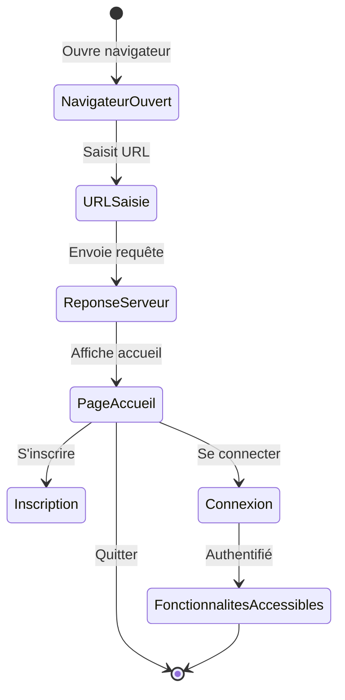

# Scénario 1 : Accès à l'application web

## Nom du Scénario
Accès à l'application web

## Description
Un utilisateur accède à la bibliothèque numérique décentralisée via son navigateur web pour utiliser les services de partage et d'emprunt d'œuvres numériques.

## Acteurs
- **Utilisateur** : Personne souhaitant utiliser l'application
- **Système** : Application web de bibliothèque numérique

## Préconditions
- L'utilisateur dispose d'un ordinateur ou d'un appareil mobile avec accès Internet
- Un navigateur web moderne est installé sur le système

## Étapes
1. L'utilisateur ouvre son navigateur web
2. L'utilisateur saisit l'URL de l'application web
3. Le serveur répond à la requête de l'utilisateur
4. L'utilisateur accède a une présentation de l'application et peut se connecter ou s'inscrire
5. Si l'utilisateur est connecté, il accède aux fonctionnalités de l'application 

## Résultat attendu
L'utilisateur accède à l'application web et peut utiliser ses fonctionnalités si il se connecte

## Diagramme de transitions

