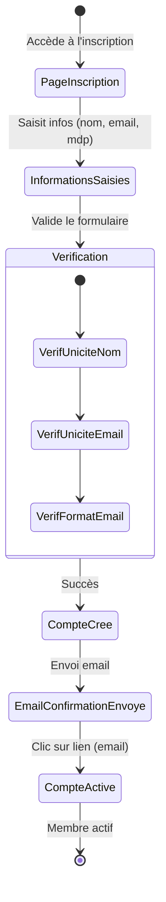

← [Accueil des scénarios](_Scenarios.md)

# Scénario 2 : Devenir membre

## Nom du Scénario
Devenir membre

## Description
Un utilisateur s'inscrit à la bibliothèque numérique via l'application web pour devenir membre et accéder aux services de partage et d'emprunt d'œuvres.

## Acteurs
- **Utilisateur** : Personne souhaitant devenir membre
- **Système** : Application web de bibliothèque numérique

## Préconditions
- L'utilisateur a accès à l'interface web via un navigateur
- L'utilisateur dispose d'une adresse email valide

## Étapes
1. L'utilisateur accède à la page d'inscription depuis son navigateur
2. L'utilisateur saisit ses informations personnelles (nom, prénom, email)
3. L'utilisateur choisit un nom d'utilisateur unique
4. L'utilisateur définit un mot de passe sécurisé
5. Le système vérifie l'unicité du nom d'utilisateur
6.  Le système vérifie l'unicité de l'email
6. Le système valide le format de l'email
7. Le système crée le compte utilisateur
8. Le système envoie un email de confirmation 
9. L'utilisateur confirme son inscription via le lien reçu par email
10. Le système active le compte membre

## Résultat attendu
L'utilisateur devient membre de la bibliothèque avec un compte actif et peut accéder aux fonctionnalités de base via l'application web.

## Diagramme de transitions

