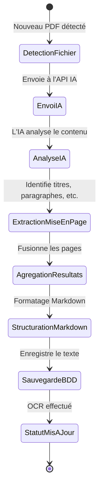

← [Accueil des scénarios](_Scenarios.md)

# Scénario 4 : Reconnaissance de texte d'une œuvre (OCR)

## Nom du Scénario
Reconnaissance de texte d'une œuvre (OCR)

## Description
Le système utilise l'intelligence artificielle pour extraire et reconnaître le texte contenu dans un fichier PDF, permettant la recherche et l'export en Markdown.

## Acteurs
- **Système** : Application de bibliothèque numérique
- **IA OCR** : (Pixtral) 
- **Bibliothécaire** : Peut déclencher manuellement le processus

## Préconditions
- Une œuvre PDF est présente dans le système
- Les clés API pour les services d'IA sont configurées
- Le fichier PDF est lisible et non corrompu

## Étapes
1. Le système détecte un nouveau fichier PDF à traiter
2. le système envoie le pdf à l'API d'IA 
3. L'IA analyse le pdf et extrait le texte et les images 
4. L'IA identifie la mise en page (titres, paragraphes, tableaux, images)
5. Le système agrège les résultats de toutes les pages
6. Le système structure le texte en format Markdown 
7. Le système sauvegarde le texte extrait dans la base de données 
8. Le système met à jour le statut de l'œuvre (OCR effectué)

## Résultat attendu
L'œuvre dispose d'une version texte searchable et exportable en Markdown avec préservation de la mise en page.

## Diagramme de transitions

