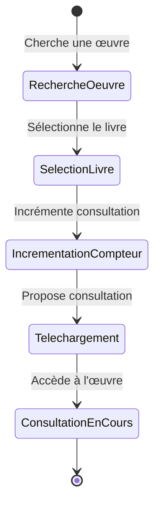

← [Accueil des scénarios](_Scenarios.md)

# Scénario 5 : Consulter une œuvre

## Nom du Scénario
Consulter une œuvre

## Description
Un membre consulte une œuvre numérique.

## Acteurs
- **Membre** : Utilisateur authentifié souhaitant emprunter une œuvre
- **Système** : Application de bibliothèque numérique
- - **IA OCR** : (Pixtral)

## Préconditions
- Le membre est connecté à son compte
- L'œuvre est disponible

## Étapes
1. Le membre recherche ou consulte une œuvre disponible
2. Le membre sélectionne le livre
3. Le compteur de consultation du livre est incrémentée de 1
4. Le membre peut télécharger et consulter l'œuvre empruntée

## Résultat attendu
Le membre peut consulter le document.

## Diagramme de transitions

