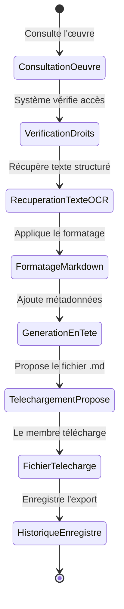

← [Accueil des scénarios](_Scenarios.md)

# Scénario 8 : Exporter une œuvre au format Markdown

## Nom du Scénario
Exporter une œuvre au format Markdown

## Description
Un membre exporte une œuvre dont le texte a été reconnu par OCR vers un fichier Markdown structuré en étant aidé par un agent IA .

## Acteurs
- **Membre** : Utilisateur authentifié souhaitant exporter une œuvre
- **Système** : Application de bibliothèque numérique
- **IA OCR** : (Pixtral)
- 
## Préconditions
- Le membre est connecté à son compte
- L'œuvre a subi un traitement OCR réussi
- Le membre a accès à l'œuvre
- Le texte de l'œuvre est disponible en base de données

## Étapes
1. Le membre consulte une œuvre disponible
2. Le système vérifie les droits d'accès à l'œuvre
3. Le système récupère le texte structuré de l'OCR
4. Le système applique le formatage Markdown (titres, paragraphes, listes)
5. Le système préserve la structure originale (chapitres, sections)
6. Le système génère les métadonnées d'en-tête (titre, auteur, date d'export)
7. Le système propose le téléchargement du fichier .md
8. Le membre télécharge le fichier Markdown
9. Le système enregistre l'export dans l'historique du membre

## Résultat attendu
Le membre obtient un fichier Markdown structuré et lisible de l'œuvre avec préservation de la mise en page originale.

## Diagramme de transitions

