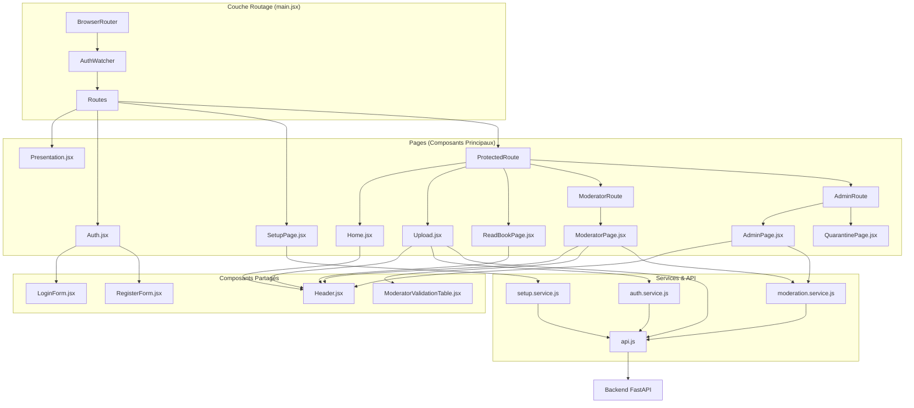

# Rapport de Conception - Interface Client

## Vue d'ensemble

L'interface client de "La Réponse D | Biblioteko" est une application web moderne développée en React qui permet aux utilisateurs de télécharger des documents PDF pour effectuer une reconnaissance optique de caractères (OCR) et obtenir une conversion en format Markdown avec analyse de contenu.

## Architecture Technique

### Stack Technologique

**Framework Principal :**
- **React 19.1.1** - Framework JavaScript pour l'interface utilisateur
- **Vite 7.1.7** - Outil de build et serveur de développement moderne

**Bibliothèques UI :**
- **Material-UI (MUI) 7.3.4** - Composants d'interface utilisateur Material Design
  - `@mui/material` - Composants de base
  - `@mui/icons-material` - Icônes Material Design
  - `@emotion/react` et `@emotion/styled` - Système de styles CSS-in-JS

**Traitement de Contenu :**
- **react-markdown 10.1.0** - Rendu des documents Markdown
- **remark-math 6.0.0** - Plugin pour le support des expressions mathématiques
- **rehype-katex 7.0.1** - Rendu des formules mathématiques avec KaTeX

**Outils de Développement :**
- **ESLint 9.36.0** - Linter JavaScript avec configuration pour React
- **TypeScript** - Types pour React et React DOM
- **Vite Plugin React** - Plugin Vite pour le support React

### Architecture des Composants



### Structure des Fichiers

```
client/
├── public/                 # Ressources statiques
│   └── vite.svg           # Favicon Vite
├── src/                   # Code source principal
│   ├── Upload.jsx            # Composant principal (600+ lignes)
│   ├── App.css            # Styles CSS pour App
│   ├── main.jsx           # Point d'entrée React
│   ├── index.css          # Styles globaux
│   └── assets/            # Ressources de l'application
├── index.html             # Template HTML principal
├── package.json           # Configuration NPM et dépendances
├── vite.config.js         # Configuration Vite
├── eslint.config.js       # Configuration ESLint
└── README.md              # Documentation du client
```

## Fonctionnalités Principales

### 1. Interface de Téléchargement de PDF
- **Sélection de fichiers** : Interface utilisateur pour sélectionner des fichiers PDF
- **Validation de format** : Vérification que seuls les fichiers PDF sont acceptés
- **Indicateur de progression** : Animation de chargement pendant le traitement

### 2. Communication avec l'API Backend
- **Endpoint** : `POST http://localhost:8000/api/send-book`
- **Format** : Envoi via FormData
- **Gestion d'erreurs** : Traitement des erreurs réseau et serveur

### 3. Affichage des Résultats OCR

#### a) Document Markdown
- **Rendu en temps réel** : Affichage du Markdown converti avec react-markdown
- **Support mathématique** : Rendu des formules mathématiques avec KaTeX
- **Téléchargement** : Fonction de téléchargement du fichier .md généré

#### b) Aperçus des Pages
- **Images base64** : Affichage des aperçus de pages OCR
- **Format data URI** : Support des images encodées en base64

#### c) Métadonnées du Document
- Titre, Auteur, Date, Éditeur
- Description (optionnelle)
- Interface utilisateur structurée avec badges de statut

### 4. Analyses de Sécurité et de Contenu

#### Analyse de Sécurité
- **Détection de prompts** : Identification de tentatives d'injection
- **Niveaux de risque** : Classification (low/medium/high)
- **Interface visuelle** : Badges colorés selon le niveau de risque

#### Analyse de Contenu
- **Détection de contenu inapproprié** : Vérification de l'appropriateness du contenu
- **Avertissements** : Affichage des warnings de contenu
- **Sévérité** : Classification du niveau de sévérité

## Architecture des Composants

### Composant Principal (Upload.jsx)

**État de l'Application :**
- message: string                    // Messages de statut
- selectedFile: File                 // Fichier PDF sélectionné
- images: Array<{id, src}>          // Images OCR extraites
- mergedMarkdown: string            // Contenu Markdown fusionné
- metadata: Object                  // Métadonnées du document
- securityAnalysis: Object          // Résultats d'analyse de sécurité
- contentAnalysis: Object           // Résultats d'analyse de contenu
- isLoading: boolean               // État de chargement

**Fonctions Principales :**
- `handleFileChange()` - Gestion de la sélection de fichier et envoi API
- `extractImagesFromResult()` - Extraction des images base64 de la réponse OCR
- `extractAndMergeMarkdown()` - Extraction du contenu Markdown
- `extractMetadata()` - Extraction des métadonnées
- `downloadMarkdown()` - Téléchargement du fichier Markdown

### Système de Styles

**Approche CSS-in-JS :**
- Styles définis dans un objet JavaScript
- Styles réactifs avec états hover/disabled
- Animations CSS (spinner de chargement)
- Design responsive centré

**Thème Visuel :**
- Couleur principale : #2196f3 (bleu Material Design)
- Palette de couleurs pour les niveaux de risque
- Typographie claire et lisible
- Espacement et padding cohérents

## Configuration et Build

### Configuration Vite
- Plugin React activé
- Configuration minimale pour un démarrage rapide
- Support ES modules natif

### Configuration ESLint
- Règles recommandées JavaScript
- Plugins React Hooks et React Refresh
- Configuration pour environnement navigateur
- Gestion des variables non utilisées

### Scripts NPM
- `dev`: `vite` - Serveur de développement
- `build`: `vite build` - Build de production
- `lint`: `eslint .` - Vérification du code
- `preview`: `vite preview` - Prévisualisation du build

## Points d'Amélioration Identifiés

### 1. Architecture
- **Séparation des responsabilités** : Le composant Upload.jsx est très volumineux (600+ lignes)
- **Modularisation** : Diviser en composants plus petits et réutilisables
- **Gestion d'état** : Considérer l'utilisation de Context API ou Redux pour un état global

### 2. Performance
- **Memoïsation** : Utiliser React.memo pour les composants lourds
- **Lazy loading** : Chargement différé des images et du contenu Markdown
- **Optimisation des re-rendus** : Utiliser useCallback et useMemo

### 3. Qualité du Code
- **TypeScript** : Migration vers TypeScript pour une meilleure sûreté de type
- **Tests** : Ajout de tests unitaires et d'intégration
- **Documentation** : JSDoc pour les fonctions complexes

### 4. UX/UI
- **Responsive design** : Amélioration pour les appareils mobiles
- **Accessibilité** : Conformité WCAG
- **Gestion d'erreurs** : Messages d'erreur plus informatifs

## Recommandations pour l'Évolution

1. **Refactoring architectural** : Diviser Upload.jsx en composants métier distincts
2. **Implémentation d'un router** : Pour une navigation multi-pages
3. **Gestion d'état centralisée** : Pour une meilleure scalabilité
4. **Intégration CI/CD** : Automatisation des tests et déploiements
5. **Monitoring** : Ajout d'analytics et de monitoring d'erreurs

---