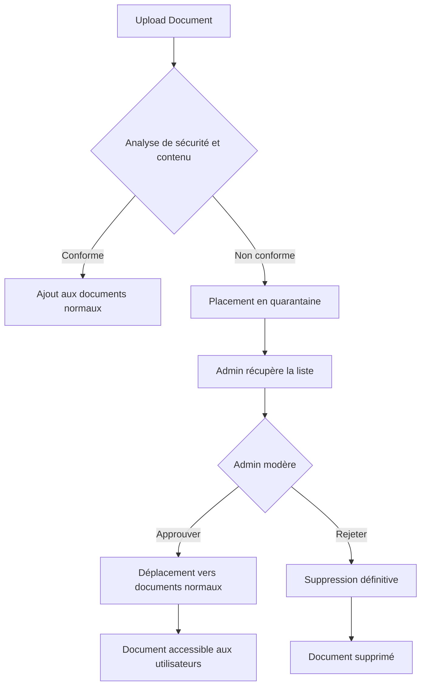

# Endpoints de Quarantaine pour Documents Non Conformes

## Vue d'ensemble

Lorsqu'un document est uploadé via l'endpoint `/api/send-book`, il passe par plusieurs analyses de sécurité et de contenu :
- **Analyse de sécurité** : Détection d'injection de prompt et de tentatives de jailbreak
- **Analyse de contenu** : Vérification du contenu approprié

Si au moins une analyse détecte un problème, le document est automatiquement placé en **quarantaine** au lieu d'être ajouté aux documents normaux.

## Stockage dans Redis

### Documents normaux
- **Clé** : `document:{document_id}`
- **Index** : `document_ids`

### Documents en quarantaine
- **Clé** : `quarantine:{document_id}`
- **Index** : `quarantine_document_ids`

## Endpoints Admin

### 1. Récupérer tous les documents en quarantaine

**GET** `/api/admin/quarantine`

Récupère la liste de tous les documents placés en quarantaine.

**Headers requis:**
```
Authorization: Bearer <token_jwt>
```

**Réponse (200):**
```json
{
  "count": 2,
  "documents": [
    {
      "document_id": "doc_20231215120000_1",
      "metadata": {
        "title": "Document Suspect",
        "author": "Auteur Inconnu",
        "parution_date": "2023",
        "is_appropriate": "false",
        "is_harmful": true
      },
      "uploader": {
        "username": "user123",
        "upload_date": "2023-12-15T12:00:00"
      },
      "moderation": {
        "approval_process": {
          "status": "WAITING",
          "date": "2023-12-15T12:00:00",
          "details": "Injection de prompt détectée; Contenu inapproprié détecté"
        },
        "approved_by": []
      },
      "in_quarantine": true,
      "security_analysis": {
        "has_prompt_injection": true,
        "has_jailbreak_attempt": false
      },
      "content_analysis": {
        "is_appropriate": false
      },
      "compliance_issues": [
        "Injection de prompt détectée",
        "Contenu inapproprié détecté"
      ]
    }
  ]
}
```

**Erreurs:**
- `401` : Token manquant ou invalide
- `403` : Utilisateur non autorisé (pas admin)
- `500` : Erreur serveur

---

### 2. Récupérer un document en quarantaine spécifique

**GET** `/api/admin/quarantine/{document_id}`

Récupère les détails d'un document en quarantaine spécifique.

**Headers requis:**
```
Authorization: Bearer <token_jwt>
```

**Paramètres:**
- `document_id` (path) : L'ID du document à récupérer

**Réponse (200):**
```json
{
  "document_id": "doc_20231215120000_1",
  "metadata": {
    "title": "Document Suspect",
    "author": "Auteur Inconnu"
  },
  "in_quarantine": true,
  "security_analysis": {
    "has_prompt_injection": true,
    "has_jailbreak_attempt": false
  },
  "content_analysis": {
    "is_appropriate": false
  },
  "compliance_issues": [
    "Injection de prompt détectée",
    "Contenu inapproprié détecté"
  ]
}
```

**Erreurs:**
- `401` : Token manquant ou invalide
- `403` : Utilisateur non autorisé (pas admin)
- `404` : Document en quarantaine introuvable
- `500` : Erreur serveur

---

### 3. Modérer un document en quarantaine

**POST** `/api/admin/quarantine/{document_id}/moderate?action={action}`

Modère un document en quarantaine : l'approuver (le déplacer vers les documents normaux) ou le rejeter (le supprimer).

**Headers requis:**
```
Authorization: Bearer <token_jwt>
```

**Paramètres:**
- `document_id` (path) : L'ID du document à modérer
- `action` (query) : Action à effectuer
  - `approve` : Approuver et déplacer vers les documents normaux
  - `reject` : Rejeter et supprimer définitivement

**Exemple - Approuver:**
```bash
POST /api/admin/quarantine/doc_20231215120000_1/moderate?action=approve
```

**Réponse (200) - Approbation:**
```json
{
  "message": "Document approuvé et déplacé vers les documents normaux.",
  "document_id": "doc_20231215120000_1",
  "action": "approved",
  "moderated_by": "admin_user"
}
```

**Exemple - Rejeter:**
```bash
POST /api/admin/quarantine/doc_20231215120000_1/moderate?action=reject
```

**Réponse (200) - Rejet:**
```json
{
  "message": "Document rejeté et supprimé de la base de données.",
  "document_id": "doc_20231215120000_1",
  "action": "rejected",
  "moderated_by": "admin_user"
}
```

**Erreurs:**
- `400` : Action invalide (doit être 'approve' ou 'reject')
- `401` : Token manquant ou invalide
- `403` : Utilisateur non autorisé (pas admin)
- `404` : Document en quarantaine introuvable
- `500` : Erreur serveur

---

## Flux de modération



## Exemple d'utilisation avec curl

### Récupérer les documents en quarantaine
```bash
curl -X GET "http://localhost:8000/api/admin/quarantine" \
  -H "Authorization: Bearer YOUR_JWT_TOKEN"
```

### Approuver un document
```bash
curl -X POST "http://localhost:8000/api/admin/quarantine/doc_20231215120000_1/moderate?action=approve" \
  -H "Authorization: Bearer YOUR_JWT_TOKEN"
```

### Rejeter un document
```bash
curl -X POST "http://localhost:8000/api/admin/quarantine/doc_20231215120000_1/moderate?action=reject" \
  -H "Authorization: Bearer YOUR_JWT_TOKEN"
```

## Exemple d'utilisation avec JavaScript (Frontend)

```javascript
// Récupérer le token d'authentification
const token = localStorage.getItem('authToken');

// Récupérer tous les documents en quarantaine
async function getQuarantinedDocuments() {
  const response = await fetch('http://localhost:8000/api/admin/quarantine', {
    method: 'GET',
    headers: {
      'Authorization': `Bearer ${token}`
    }
  });
  
  if (!response.ok) {
    throw new Error('Erreur lors de la récupération des documents en quarantaine');
  }
  
  const data = await response.json();
  return data.documents;
}

// Approuver un document
async function approveDocument(documentId) {
  const response = await fetch(
    `http://localhost:8000/api/admin/quarantine/${documentId}/moderate?action=approve`,
    {
      method: 'POST',
      headers: {
        'Authorization': `Bearer ${token}`
      }
    }
  );
  
  if (!response.ok) {
    throw new Error('Erreur lors de l\'approbation du document');
  }
  
  return await response.json();
}

// Rejeter un document
async function rejectDocument(documentId) {
  const response = await fetch(
    `http://localhost:8000/api/admin/quarantine/${documentId}/moderate?action=reject`,
    {
      method: 'POST',
      headers: {
        'Authorization': `Bearer ${token}`
      }
    }
  );
  
  if (!response.ok) {
    throw new Error('Erreur lors du rejet du document');
  }
  
  return await response.json();
}

// Utilisation
try {
  const quarantinedDocs = await getQuarantinedDocuments();
  console.log('Documents en quarantaine:', quarantinedDocs);
  
  // Approuver le premier document
  if (quarantinedDocs.length > 0) {
    const result = await approveDocument(quarantinedDocs[0].document_id);
    console.log('Résultat de l\'approbation:', result);
  }
} catch (error) {
  console.error('Erreur:', error);
}
```

## Sécurité

- **Tous les endpoints de quarantaine sont protégés** par vérification JWT
- **Seuls les utilisateurs avec `account_type: "ADMIN"`** peuvent accéder à ces endpoints
- Le token JWT doit être valide et non expiré
- Le format du header Authorization doit être : `Bearer <token>`

## Notes importantes

1. **Documents en quarantaine ne sont pas visibles** dans les endpoints publics (GET /api/documents)
2. **Les documents approuvés** sont déplacés vers les documents normaux avec le statut "OK"
3. **Les documents rejetés** sont supprimés définitivement de la base de données
4. **Traçabilité** : Le username de l'admin modérateur est retourné dans la réponse

